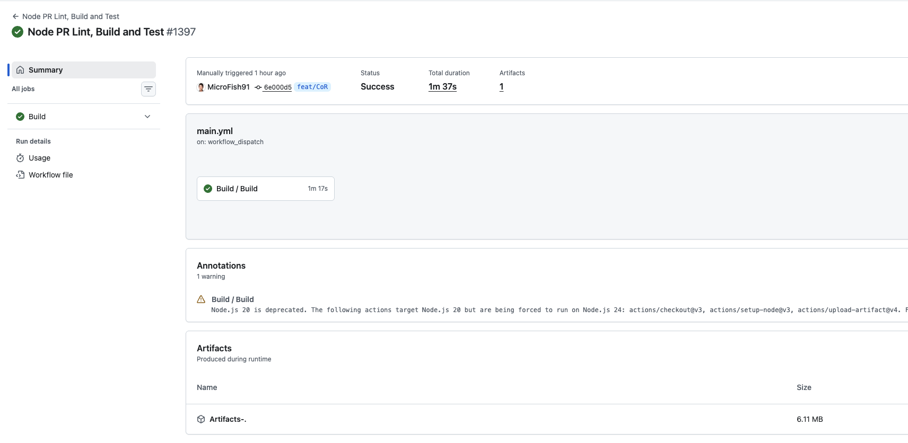
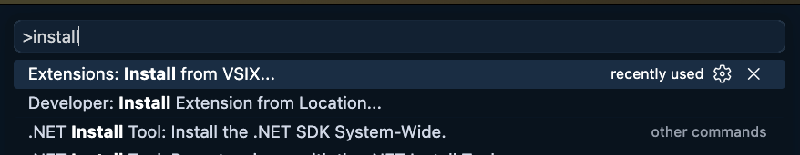
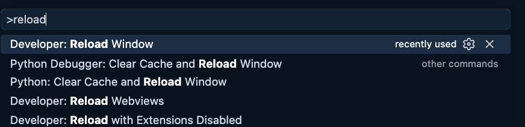
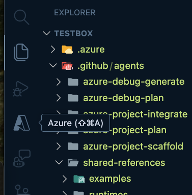
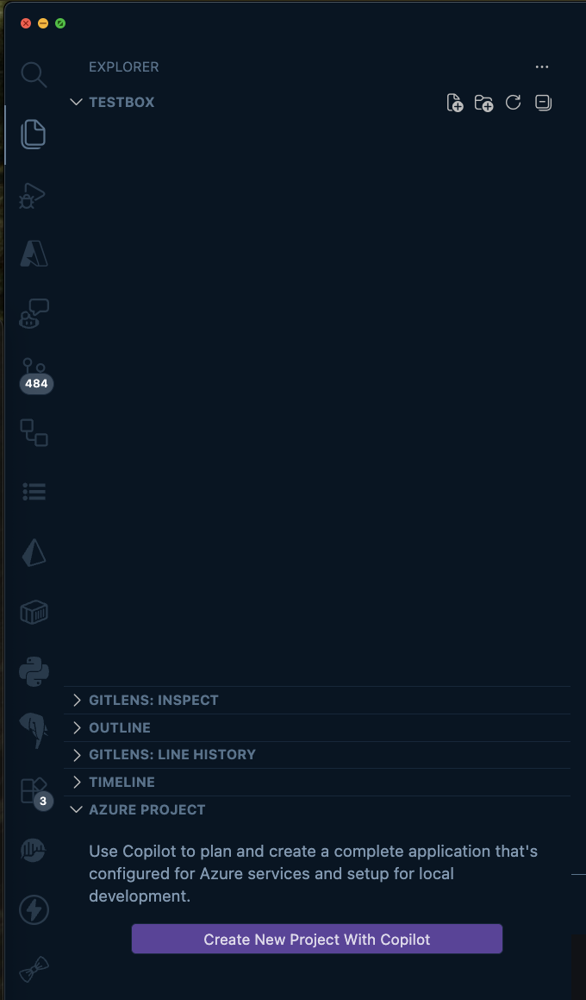
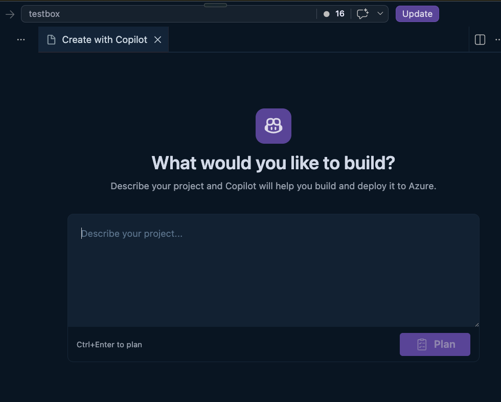

# Testing Copilot on Rails

This guide walks you through installing and setting up the latest VSIX build so you can
preview the **Copilot on Rails** feature inside VS Code.

---

## 1. Download the VSIX artifact

1. Open the GitHub Actions run that produces the build:

   👉 https://github.com/microsoft/vscode-azureresourcegroups/actions/runs/28190009715

2. Scroll to the bottom of the run summary to the **Artifacts** section.
3. Click the artifact (e.g. `Artifacts-.`) to download it.

4. Unzip the downloaded archive. Inside you'll find a **`.vsix`** file — this is the
   extension build you'll install in the next step.

---

## 2. Install the VSIX in VS Code

1. Open VS Code.
2. Press **`F1`** (or `Cmd/Ctrl+Shift+P`) to open the Command Palette.
3. Type **`install`** and select **`Extensions: Install from VSIX...`**.

4. Browse to the `.vsix` file you unzipped and select it.

---

## 3. Reload VS Code

After the VSIX installs, reload the window so the new build is active.

1. Press **`F1`** to open the Command Palette.
2. Type **`reload`** and select **`Developer: Reload Window`**.

---

## 4. Activate the extension

The extension needs to be activated before the Copilot on Rails entry point appears.
For now, the quickest way to activate it is to open the **Azure** pane.

1. Click the **Azure** icon in the Activity Bar (or press **`Shift+Cmd+A`** / `Shift+Alt+A`).

> 💡 This activation step is temporary — we plan to make activation smoother in a future build.

---

## 5. Create a new project with Copilot

1. Open an **empty folder** as your workspace. The **AZURE PROJECT** section only appears when an empty workspace is open.
2. Open the **Explorer** pane.
3. Scroll to the bottom and expand the **AZURE PROJECT** section.
4. Click **Create New Project With Copilot**.

> ℹ️ If you don't see the **AZURE PROJECT** section, double-check that your workspace is an empty folder and try again.

---

## 6. Provide a prompt and start the guided experience

After clicking **Create New Project With Copilot**, the **Create with Copilot** page opens.
Describe what you'd like to build, then start the guided Copilot experience.

From here, Copilot guides you through planning and creating an application configured for
Azure services and set up for local development.

---

## ⚠️ Current limitations (please read before you start)

As you go through the guided questions, Copilot will ask about things like your **runtime**
and the **kinds of services** you want to build. We offer a lot of options, but this build
only **actively supports** a subset of them today. To get the best experience, steer your
projects toward the supported options below:

**Actively supported in this build:**

- **Languages:** TypeScript, JavaScript
- **Service types:**
  - Azure Functions
  - Front-end apps
- **Local emulators:** Storage and PostgreSQL

**Not yet fully supported:**

- Other languages (and associated runtimes), service types, and emulators may be selectable, but may not produce consistent output in this build yet.

> 🚧 We **haven't added warnings yet** for unsupported or limited-support options — so if you
> pick something outside the list above, you may hit rough edges. We plan to expand full
> support and add these warnings in future builds.

We appreciate any and all feedback.  Thanks for testing Copilot on Rails! 🚀
