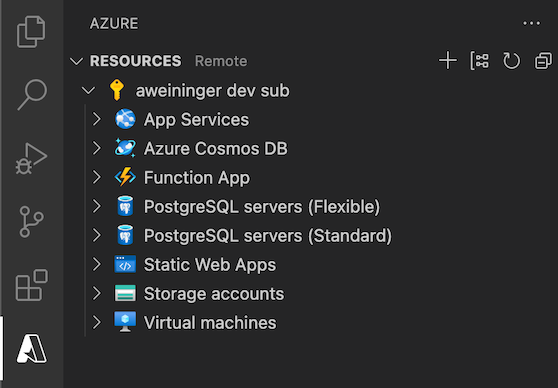
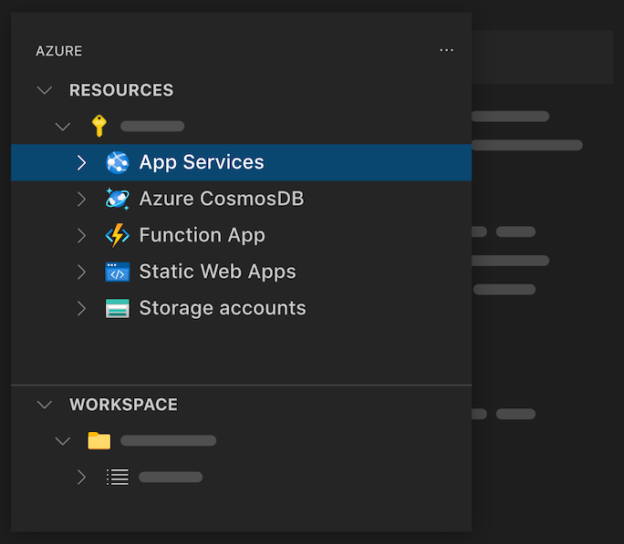
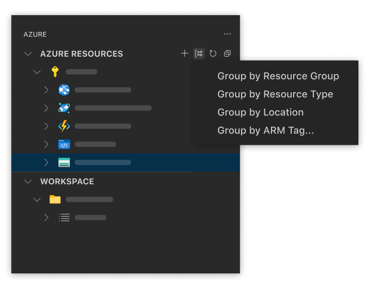
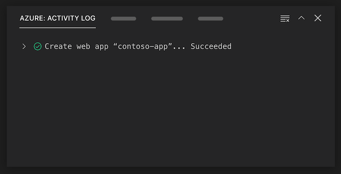
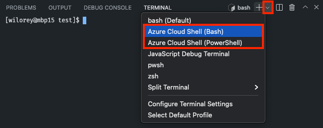
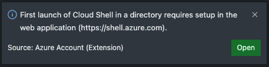
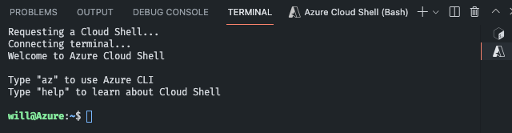

# Azure Resources for Visual Studio Code (Preview)

<!-- region exclude-from-marketplace -->

  

<!-- endregion exclude-from-marketplace -->

View and manage Azure resources directly from VS Code.

> Sign up today for your free Azure account and receive 12 months of free popular services, $200 free credit and 25+ always free services 👉 [Start Free](https://azure.microsoft.com/free/open-source).

### Move to built-in VS Code authentication

The Azure Resources extension now uses the [built-in VS Code Microsoft authentication provider](https://github.com/microsoft/vscode/tree/main/extensions/microsoft-authentication) to authenticate with Azure, and no longer depends on the [Azure Account extension](https://marketplace.visualstudio.com/items?itemName=ms-vscode.azure-account). This move increases the reliability of Azure authentication, especially when using a proxy.

#### How to Sign In

Sign in by selecting the "Sign in to Azure..." item in the Azure Resources view.

> Note: Sessions won't be migrated from Azure Account to the new built-in authentication. This means you will have to sign in once Azure Resources updates to v0.8.0.

You can also sign in using the new "Azure: Sign In" command contributed by the Azure Resources extension. Note: make sure you don't mistake it for the old Azure Account "Azure: Sign In" command.

#### How to Sign Out

Sign out in the Accounts menu located in the bottom left of your VS Code window.

#### Filter Subscriptions

You can filter the displayed subscriptions just as before, by selecting the Filter icon on any subscription. Previously filtered subscriptions will not be migrated automatically.

The filtered subscriptions are stored in the new `azureResourceGroups.selectedSubscriptions` setting.

#### Sign In to a Specific Directory/Tenant

Use the new "Sign in to Directory" command to sign in to directories that cannot be automatically authenticated to on initial sign in. This is useful for directories/tenants that require MFA. Executing this command will show a menu with a list of unauthenticated directories. If the list is empty, then sessions exist for each directory already.

#### Using Sovereign Clouds

To connect to a sovereign cloud, set the `microsoft-sovereign-cloud.environment` setting.

## Support for [vscode.dev](https://vscode.dev/)

The Azure Resources extension fully supports running on [vscode.dev](https://vscode.dev/) and [github.dev](http://github.dev/). This means you can use the Azure Resources extension to manage your Azure resources directly from your browser! Note that this does not require the Azure Accounts extension and uses VS Code's built-in authentication provider.

## Features

### Resource and Workspace views

Use the Resources explorer to create and manage Azure resources. Use the Workspace explorer to create files and deploy.

### Grouping

Change the way resources are grouped to fit your workflow.

### Activity Log

View all of your recent activities and quickly access resources you've recently created in the Activity Log.

### Create Resources

Create an Azure resource from your installed extensions directly in VS Code.

### Azure Cloud Shell

Azure Cloud Shell instances can be started via the terminal view in VS Code. To begin, click the
dropdown arrow in the terminal view and select from either `Azure Cloud Shell (Bash)` or
`Azure Cloud Shell (PowerShell)`.

If this is your first time using the Cloud Shell, the following notification will appear prompting
you to set it up.

The Cloud Shell will load in the terminal view once you've finished configuring it.

You may also upload files to Cloud Shell using the `Azure: Upload to Cloud Shell` command.

## Azure Extensions

Install these extensions to enable additional resource-specific features.

* [Azure Functions](https://marketplace.visualstudio.com/items?itemName=ms-azuretools.vscode-azurefunctions)
* [Azure App Service](https://marketplace.visualstudio.com/items?itemName=ms-azuretools.vscode-azureappservice)
* [Azure Static Web Apps](https://marketplace.visualstudio.com/items?itemName=ms-azuretools.vscode-azurestaticwebapps)
* [Azure Databases](https://marketplace.visualstudio.com/items?itemName=ms-azuretools.vscode-cosmosdb)
* [Azure Storage](https://marketplace.visualstudio.com/items?itemName=ms-azuretools.vscode-azurestorage)
* [Azure Virtual Machines](https://marketplace.visualstudio.com/items?itemName=ms-azuretools.vscode-azurevirtualmachines)
* [Azure Spring Apps](https://marketplace.visualstudio.com/items?itemName=vscjava.vscode-azurespringcloud)
* [Azure Logic Apps](https://marketplace.visualstudio.com/items?itemName=ms-azuretools.vscode-azurelogicapps)

<!-- region exclude-from-marketplace -->

## Contributing

There are a couple of ways you can contribute to this repo:

* **Ideas, feature requests and bugs**: We are open to all ideas and we want to get rid of bugs! Use the Issues section to either report a new issue, provide your ideas or contribute to existing threads.
* **Documentation**: Found a typo or strangely worded sentences? Submit a PR!
* **Code**: Contribute bug fixes, features or design changes:
  * Clone the repository locally and open in VS Code.
  * Run "Extensions: Show Recommended Extensions" from the [command palette](https://code.visualstudio.com/docs/getstarted/userinterface#_command-palette) and install all extensions listed under "Workspace Recommendations"
  * Open the terminal (press <kbd>CTRL</kbd>+ <kbd>\`</kbd>) and run `npm install`.
  * To build, press <kbd>F1</kbd> and type in `Tasks: Run Build Task`.
  * Debug: press <kbd>F5</kbd> to start debugging the extension.

### Legal

Before we can accept your pull request you will need to sign a **Contribution License Agreement**. All you need to do is to submit a pull request, then the PR will get appropriately labelled (e.g. `cla-required`, `cla-norequired`, `cla-signed`, `cla-already-signed`). If you already signed the agreement we will continue with reviewing the PR, otherwise system will tell you how you can sign the CLA. Once you sign the CLA all future PR's will be labeled as `cla-signed`.

### Code of Conduct

This project has adopted the [Microsoft Open Source Code of Conduct](https://opensource.microsoft.com/codeofconduct/). For more information see the [Code of Conduct FAQ](https://opensource.microsoft.com/codeofconduct/faq/) or contact [opencode@microsoft.com](mailto:opencode@microsoft.com) with any additional questions or comments.

<!-- endregion exclude-from-marketplace -->

## Telemetry

VS Code collects usage data and sends it to Microsoft to help improve our products and services. Read our [privacy statement](https://go.microsoft.com/fwlink/?LinkID=528096&clcid=0x409) to learn more. If you don’t wish to send usage data to Microsoft, you can set the `telemetry.enableTelemetry` setting to `false`. Learn more in our [FAQ](https://code.visualstudio.com/docs/supporting/faq#_how-to-disable-telemetry-reporting).

## License

[MIT](LICENSE.md)
