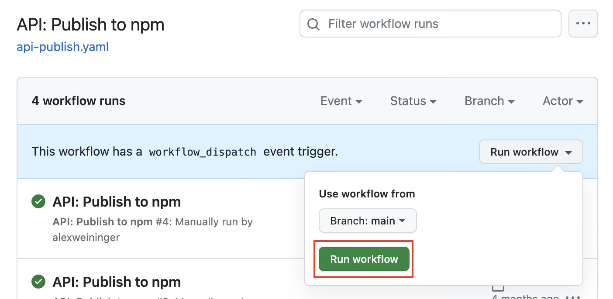

# Contributing

## Releasing the `@microsoft/vscode-azureresources-api` package

Open a release prep PR with the following changes:
1. Bump the version
2. Update the changelog
3. Generate the rolled up api typings using `npm run api-extractor`
4. Copy the generated `api/dist/vscode-azureresources-api.d.ts` file into `api/docs/` to update the typings used for documentation.

Once the release prep PR has merged, the package can be published using the [api-publish GitHub Action workflow](https://github.com/microsoft/vscode-azureresourcegroups/actions/workflows/api-publish.yaml).

