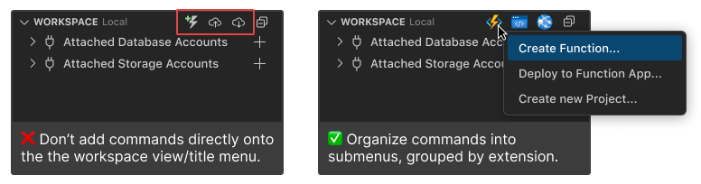

# VS Code Azure Resources API

Provides typings and utilities for the VS Code Azure Resources API. This API is used to integrate "client" Azure extensions into views provided by the [Azure Resources "host" extension for VS Code](https://marketplace.visualstudio.com/items?itemName=ms-azuretools.vscode-azureresourcegroups).

## Overview

The Azure Resources extension for VS Code contributes the **Azure resources view** and the **Workspace resources view**. The Azure view lets users browse and work with supported resources in Azure. The Workspace resources view is home to development related resources like an emulated database, or a functions project detected in an open workspace folder.

In the past, each supported Azure resource had a dedicated view in the Azure view container. In the updated design, the Azure resources and Workspace resources views contain all resources.
To facilitate this design, each Azure **product extension** contributes to a single **host extension**.

The Azure Resources extension provides small generic features for all Azure resource types. Users can then install Azure product extensions to enable rich, product-specific features.

The Azure Resources extension exposes an API which enables any number of client extensions to contribute UI and functionality to the Azure and Workspace resources views.

## Capabilities

### Tree views


The Azure Resources extension contributes two extendable views. The Resources view, and the Workspace view. In the Resources view, clients can customize resource tree items, and have full control over resource tree item children.

For the Workspace view, clients can contribute root level tree items to the view. Clients have full control over these tree items and their children.

<br clear="right"/>

### Create Resource command


<br/>
<br/>
Client extensions can add items to the Azure Resources "Create Resource..." command quick pick prompt.

<br clear="right"/>


## API Overview

### Branch data provider

The VS Code API provides a `TreeDataProvider` interface for controlling tree views. In order to make the Azure trees extensible, the host extension splits tree views into "branches", where each branch is controlled by a branch data provider. Clients can register a `BranchDataProvider` for a resource type. The registered branch data provider is then responsible for providing the tree items for that branch in the tree view. `BranchDataProvider` is an extension of [VS Code's `TreeDataProvider`](https://code.visualstudio.com/api/references/vscode-api#TreeDataProvider).

> Note: clients registering resource providers must declare that they do so in their extension manifest. See [Extension Manifest](#extension-manifest)

```ts
/**
 * The base interface for visualizers of Azure and workspace resources.
 */
export interface BranchDataProvider<TResource extends ResourceBase, TModel extends ResourceModelBase> extends vscode.TreeDataProvider<TModel> {
    /**
     * Get the children of `element`.
     *
     * @param element The element from which the provider gets children. Unlike a traditional tree data provider, this will never be `undefined`.
     *
     * @return Children of `element`.
     */
    getChildren(element: TModel): vscode.ProviderResult<TModel[]>;

    /**
     * Called to get the provider's model element for a specific resource.
     *
     * @remarks getChildren() assumes that the provider passes a known (TModel) model item, or undefined when getting the "root" children.
     *          However, branch data providers have no "root" so this function is called for each matching resource to obtain a starting branch item.
     *
     * @returns The provider's model element for `resource`.
     */
    getResourceItem(element: TResource): TModel | Thenable<TModel>;
}
```

### Resource provider

Clients register resource providers to add resources to a view. Currently the API is limited to registering Workspace resource providers because a default Azure resource provider is built into the Azure Resources extension.

> Note: clients registering resource providers must declare that they do so in their extension manifest. See [Extension Manifest](#extension-manifest)

```ts
/**
 * The base interface for providers of Azure and workspace resources.
 */
export interface ResourceProvider<TResourceSource, TResource extends ResourceBase> {
    /**
     * Fired when the provider's resources have changed.
     */
    readonly onDidChangeResource?: vscode.Event<TResource | undefined>;

    /**
     * Called to supply the resources used as the basis for the resource views.
     *
     * @param source The source from which resources should be generated.
     *
     * @returns The resources to be displayed in the resource view.
     */
    getResources(source: TResourceSource): vscode.ProviderResult<TResource[]>;
}
```

## Extension manifest

Client extensions define an `x-azResources` object on inside of `contributes` in the extension manifest `package.json` file.

This object informs the host extension when to activate the client extension and what contributions the client extension makes to the shared views.

```ts
azure?: {
    /**
     * List of Azure resource types this extension registers a BranchDataProvider for.
     */
    branches: {
        /**
         * The resource type the BranchDataProvider is registered for.
         */
        type: AzExtResourceType
    }[];
};

/**
 * List of Workspace resource types this extension registers a BranchDataProvider for.
 */
workspace?: {
    branches: {
        /**
         * The resource type the BranchDataProvider is registered for.
         */
        type: string;
    }[];

    /**
     * Whether this extension registers a WorkspaceResourceProvider.
     */
    resources?: boolean;
};

/**
 * Commands to add to the "Create Resource..." quick pick prompt.
 */
commands?: {
    command: string;
    title: string;
    detail: string;
    type?: string; // Optional: resource type associated with the command. Used to show an icon next to the command.
}[];
```

> [View definition of `AzExtResourceType`](../src/AzExtResourceType.ts)

The contribution object from the Azure Functions extension is shown below as an example.

This extension declares that it registers a BranchDataProvider for the `FunctionApp` resource type in the Azure resources view, and a BranchDataProvider for the `func` resource type in the Workspace resources view. It also registers a WorkspaceResourceProvider. Finally, it contributes a command to the "Create Resource..." quick pick prompt for creating a Function App.


```jsonc
{
    "contributes": {
        "x-azResources": {
            "azure": {
                "branches": [
                    // extension registers a BranchDataProvider for Function Apps
                    {
                        "type": "FunctionApp"
                    }
                ]
            },
            "workspace": {
                "branches": [
                    // extension registers a BranchDataProvider for workspace resources of type "func"
                    {
                        "type": "func"
                    }
                ],
                // extension registers a WorkspaceResourceProvider
                "resources": true
            },
            "commands": [
                // extension contributes a command to the "Create Resource..." quick pick prompt
                {
                    "command": "azureFunctions.createFunctionApp",
                    "title": "%azureFunctions.createFunctionApp%",
                    "detail": "%azureFunctions.createFunctionAppDetail%"
                }
            ],
        },
        // other extension contributions
    }
}
```

> <details>
> <summary>Example without comments (good for copying 😄)</summary>
>
>
> ```json
> "x-azResources": {
>     "azure": {
>         "branches": [
>             {
>                 "type": "FunctionApp"
>             }
>         ]
>     },
>     "workspace": {
>         "branches": [
>             {
>                 "type": "func"
>             }
>         ],
>         "resources": true
>     },
>     "commands": [
>         {
>             "command": "azureFunctions.createFunctionApp",
>             "title": "%azureFunctions.createFunctionApp%",
>             "detail": "%azureFunctions.createFunctionAppDetail%"
>         }
>     ]
> }
> ```
> </details>

## Getting started

On activation, client extensions can fetch an instance of the Azure Resources API using the `getAzureResourcesExtensionApi` utility provided by the [`@microsoft/vscode-azureresources-api`](https://www.npmjs.com/package/@microsoft/vscode-azureresources-api) package.

```ts
import { getAzureResourcesExtensionApi } from '@microsoft/vscode-azureresources-api';

export async function activate(context: vscode.ExtensionContext): Promise<void> {
    const azureResourcesApi = await getAzureResourcesExtensionApi(context, '2.0.0');
    // ...register providers
}
```

<!-- ## Contribute to the Azure resources view

todo

## Contribute to the Workspace resources view

- register workspace resource provider for `type`
- register workspace resource branch data provider for `type` -->

## Contributing to the Workspace resources view

### `view/title` commands

Client extensions are encouraged to make commands accessible via the workspace `view/title` menu. Commands should be grouped by extension into submenus. Submenu icons and titles should be the same as the client extension's icon and title. This is to prevent the `view/title` menu from becoming too cluttered.



Here's an example of how the Azure Functions extension contributes commands to the workspace `view/title` menu. See [the Azure Functions package.json](https://github.com/microsoft/vscode-azurefunctions/blob/main/package.json) for reference.

```jsonc
"submenus": [
    // define the submenu
    {
        "id": "azureFunctions.submenus.workspaceActions",
        "icon": "resources/azure-functions.png",
        "label": "Azure Functions"
    }
],
"menus": {
    // add commands to the submenu
    "azureFunctions.submenus.workspaceActions": [
        {
            "command": "azureFunctions.createFunction",
            "group": "1_projects@1"
        },
        {
            "command": "azureFunctions.createNewProject",
            "group": "1_projects@2"
        },
        {
            "command": "azureFunctions.deploy",
            "group": "2_deploy@1"
        },
        {
            "command": "azureFunctions.createFunctionApp",
            "group": "3_create@1"
        },
        {
            "command": "azureFunctions.createFunctionAppAdvanced",
            "group": "3_create@2"
        }
    ],
    // add the submenu to the workspace view/title menu
    "view/title": [
        {
            "submenu": "azureFunctions.submenus.workspaceActions",
            "when": "view == azureWorkspace",
            "group": "navigation@1"
        }
    ],
}
```

## Extension dependencies


Client extensions must declare the Azure Resources extension as an extension dependency in their extension manifest `package.json` file.

```json
"extensionDependencies": [
    "ms-azuretools.vscode-azureresources"
]
```

<br clear="right"/>


## Example extensions

The following extensions are integrated with the Azure Resources API v2. They are great examples of how to use the API.

- [Azure Dev CLI](https://github.com/Azure/azure-dev/tree/main/ext/vscode)
- [Azure Container Apps](https://github.com/microsoft/vscode-azurecontainerapps)

## API Reference

See [vscode-azureresources-api.d.ts](https://github.com/microsoft/vscode-azureresourcegroups/blob/main/api/docs/vscode-azureresources-api.d.ts) for the full API definition.

## Terms

* **Host extension**: Azure Resources extension which exposes the Azure Resources API
* **Host API**: Azure Resources API exposed by the host extension
* **Client extension**: Extension which consumes the Azure Resources API
* **Azure resources view**: Unified view of Azure resources contributed owned by the Azure Resources extension
* **Workspace resources view**: Unified view of workspace resources contributed by client extensions
* **Azure resource**: A resource that can be represented in the Azure resources view.
* **Workspace resource**: Any resource that is located on the local machine, or in the opened workspace.

<!-- ## Document todo list

big todo:
* Add overall architecture section
* FAQ
* Add a section on how to contribute to the Azure resources view
* Add a section on how to contribute to the Workspace resources view

small todo:
* Don't forget to add the Azure Resources extension as a dependency in your extension's package.json
* how to pick a tree item
* add a create resource command
* portalUrl and viewProperties features
* Adding a product icon and display name

Utils

- Add value to the `AzExtResourceType` enum in utils
- Update `AzExtResourceType` type in index.d.ts
- Modify `getAzExtResourceType` to return the new `AzExtResourceType` accurately

Azure Resources

- Add icon in `resources/azureIcons` folder. File name should follow `[AzExtResourceType].svg`
- Add display info in src/utils/azureUtils.ts
- Add extension to src/azureExtensions.ts

 -->
