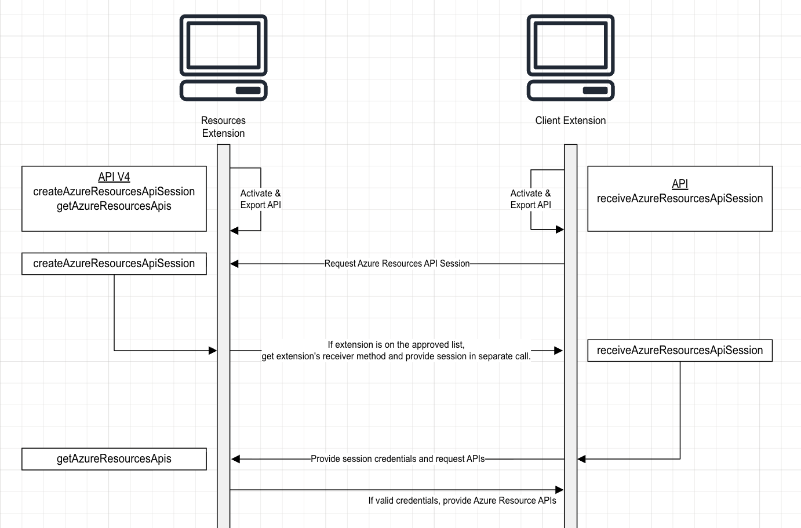

# Azure Resources Authentication and API Retrieval

This guide explains the Azure Resources authentication handshake required for API retrieval by client extensions. It also provides tools to help extensions onboard quickly and to reduce the need for custom implementations.

## The Authentication Handshake

### Setup

Azure Resources APIs are protected behind the v4 authentication layer. This layer exposes two methods that client extensions must use to gain access: `createAzureResourcesApiSession` and `getAzureResourcesApis`. On activation, client extensions must also export a receiver method called `receiveAzureResourcesSession` before initiating the handshake.

### Steps

1. On activation, the client extension exports its API and initiates the handshake by calling `createAzureResourcesApiSession`. The client extension provides its own credential as part of this request, which will be used for verification later.
1. The Azure Resources extension verifies that the requesting extension is on the approved list. If approved, Azure Resources does not respond directly. Instead, it retrieves the extension's API from VS Code using the approved extension ID, then delivers the session token via the `receiveAzureResourcesSession` receiver method. This ensures the token reaches the intended recipient, even if a malicious actor initiated the request. Azure Resources also returns the original client credential so the client extension can verify it's communicating with the genuine Azure Resources extension.
1. The client extension can then retrieve the Azure Resources APIs by passing the received session credential to `getAzureResourcesApis`.

### Diagram

## Automating the Handshake

<!-- Todo -->
