# Create New Project with Copilot

> End‑user guide **and** support / triage runbook for the *Create New Project with Copilot* feature
> (internal codename: **Copilot on Rails**, command prefix `copilotOnRails.*`) shipped by the
> **Azure Resources** extension (`ms-azuretools.vscode-azureresourcegroups`).

*Create New Project with Copilot* turns a one‑sentence idea into a running, Azure‑ready application.
It drives GitHub Copilot through a fixed pipeline of specialized agents — plan → scaffold → integrate →
debug → deploy — and surfaces each step in a native VS Code webview so you stay in control and approve
the work as it happens.

---

## Contents

- [Part 1 — Overview](#part-1--overview)
  - [What it does](#what-it-does)
  - [The pipeline at a glance](#the-pipeline-at-a-glance)
  - [Key terms](#key-terms)
- [Part 2 — End‑user guide](#part-2--end-user-guide)
  - [Prerequisites](#prerequisites)
  - [Launching the flow](#launching-the-flow)
  - [Stage 1 — Describe your project](#stage-1--describe-your-project)
  - [Stage 2 — Review requirements](#stage-2--review-requirements)
  - [Stage 3 — Review & approve the plan](#stage-3--review--approve-the-plan)
  - [Stage 4 — Scaffold & approve the UI](#stage-4--scaffold--approve-the-ui)
  - [Stage 5 — Integration](#stage-5--integration)
  - [Stage 6 — Local development (debug)](#stage-6--local-development-debug)
  - [Stage 7 — Deploy to Azure](#stage-7--deploy-to-azure)
  - [Resuming a session](#resuming-a-session)
  - [Autopilot mode](#autopilot-mode)
- [Part 3 — UI surfaces reference](#part-3--ui-surfaces-reference)
- [Part 4 — How it works](#part-4--how-it-works)
  - [The agents](#the-agents)
  - [The MCP tools](#the-mcp-tools)
  - [Files & state](#files--state)
- [Part 5 — Support & triage runbook](#part-5--support--triage-runbook)
  - [Report an issue](#report-an-issue)
  - [Inspect diagnostics](#inspect-diagnostics)
  - [What the diagnostics contain (privacy)](#what-the-diagnostics-contain-privacy)
  - [Common problems & fixes](#common-problems--fixes)
  - [Clean up resources after a failed deploy](#clean-up-resources-after-a-failed-deploy)
  - [Re‑download agent instructions](#re-download-agent-instructions)
  - [Reset a workspace's state](#reset-a-workspaces-state)
  - [Escalation checklist](#escalation-checklist)
- [Appendix — reference tables](#appendix--reference-tables)

---

# Part 1 — Overview

## What it does

From an empty folder and a short description ("a task tracker with a React UI backed by PostgreSQL"), the
feature:

1. **Plans** the app — asks a few structured questions, then writes an approvable project plan with an
   architecture, a design system, and API routes.
2. **Scaffolds** the frontend, backend, database, and API routes from the approved plan.
3. **Integrates** the pieces — wires the frontend to live backend data, creates the database schema, and
   smoke‑tests every endpoint so the app actually runs.
4. **Configures local debugging** — emulators, VS Code launch/task configs, and API tests.
5. **Prepares deployment** — generates Bicep/Terraform, `azure.yaml`, and Dockerfiles ready for `azd up`.

You approve the work at each gate. Nothing is deployed to Azure and no code is submitted anywhere without
your explicit action.

## The pipeline at a glance

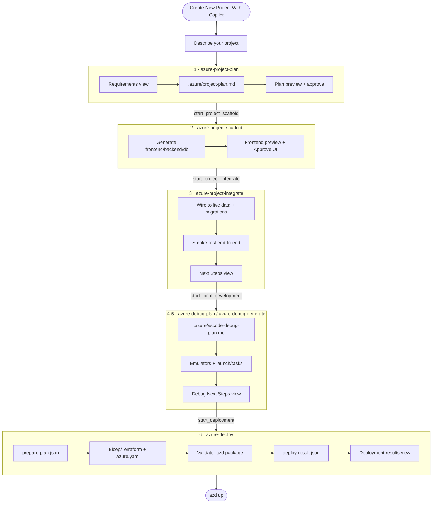

Each box is a **chat agent** (a `*.agent.md` under `resources/agents/`). Agents hand off to each other by
calling an **MCP tool** (`start_project_scaffold`, `start_project_integrate`, …) that opens a **fresh chat
session** running the next agent. Between hand‑offs, agents open **webviews** so you can review and approve.

## Key terms

| Term | Meaning |
| --- | --- |
| **Copilot on Rails / CoR** | Internal codename for this feature; the command prefix is `copilotOnRails.`. |
| **Agent** | A single‑purpose Copilot chat agent defined by a `*.agent.md` file. Six agents form the pipeline. |
| **Agent instructions** | The step‑by‑step files an agent follows. Bundled in the extension and copied into your workspace at `.github/agents/`. |
| **MCP tool** | A tool the extension exposes to Copilot (via the `vscode-azureresourcegroups.mcp` server) that opens a view or triggers the next agent. |
| **Webview / view** | A native panel the feature renders (Requirements, Plan preview, Frontend preview, Next Steps, etc.). |
| **Approval gate** | A point where the flow stops until you click **Approve** (plan, UI, deployment plan). |
| **Autopilot** | An unattended mode that skips the approval gates and next‑step prompts. |
| **`.azure/` artifacts** | The plan/requirements/integration/debug/deployment files the flow reads and writes. |

---

# Part 2 — End‑user guide

## Prerequisites

- **VS Code** with **GitHub Copilot** enabled and signed in.
- A Copilot plan with access to the supported models (the flow defaults to
  `Claude Opus 4.6 (copilot)`, `Claude Opus 4.7 (copilot)`, or `Claude Sonnet 4.6 (copilot)`).
- **An empty folder.** The flow needs a clean workspace to build in. If the open folder already contains
  files, you'll be asked to **Browse…** to an empty folder; VS Code reopens there and resumes automatically.
- **Agent instruction files.** The first time an agent runs, the extension offers to download its
  instructions into `.github/agents/`. You must accept — the agents can't run without them.

## Launching the flow

Open the **Azure Project** view (Explorer sidebar → *Azure Project*, or an empty window's welcome view) and
click **Create New Project With Copilot**. This runs the `copilotOnRails.createProjectWithCopilot` command.

  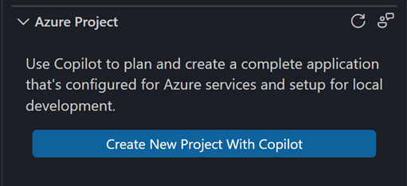

If the current folder isn't empty, you'll see this prompt first:

  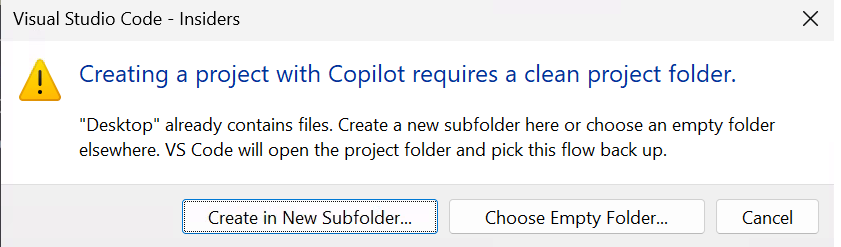

## Stage 1 — Describe your project

The **Create with Copilot** view opens with the heading **"What would you like to build?"**. Type a
description, optionally pick a **Model**, and press **Plan** (or `Ctrl+Enter`).

  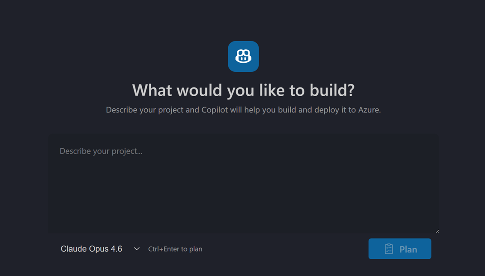

Pressing **Plan** starts the **`azure-project-plan`** agent in a new Copilot chat session.

## Stage 2 — Review requirements

The plan agent writes `.azure/requirements.json` and opens the **Requirements** view. Questions are grouped
per service (backend, frontend, worker) plus shared questions (data stores, auth). Answers Copilot could
infer are pre‑selected; the rest are pre‑filled with a recommended choice. Review each one and click
**Submit**.

  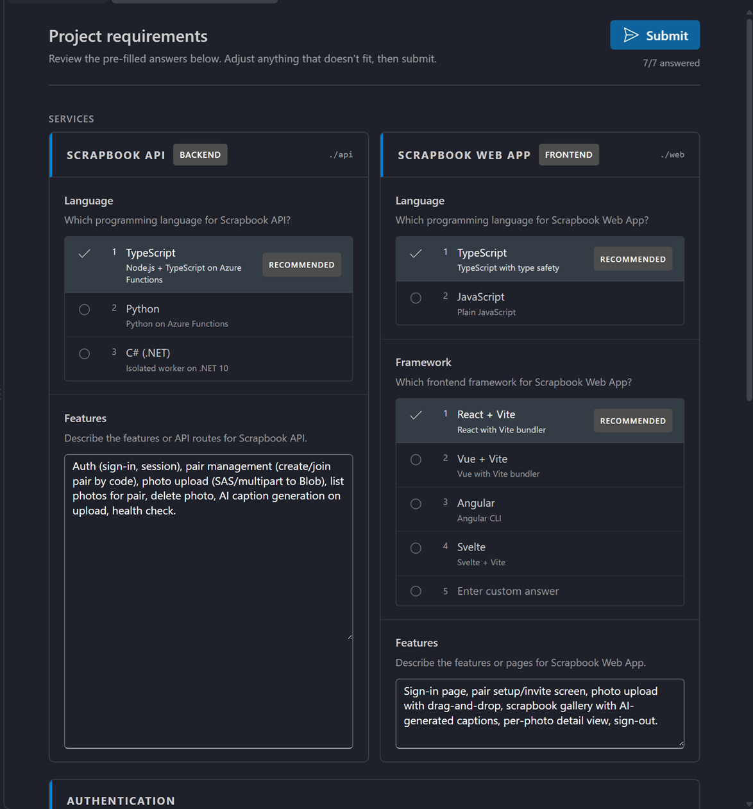

Submitting writes your confirmed answers back to `.azure/requirements.json` and re‑invokes the plan agent to
generate the plan.

## Stage 3 — Review & approve the plan

The plan agent writes `.azure/project-plan.md` (with `**Status**: Planning`) and opens the **Plan preview** view.
For apps with a UI, the preview also renders one **UI Preview** card per screen (each a sandboxed HTML
mock‑up) so you can see the proposed layout before any code is written. Read the plan, then **approve** it (or
type feedback to revise it).

  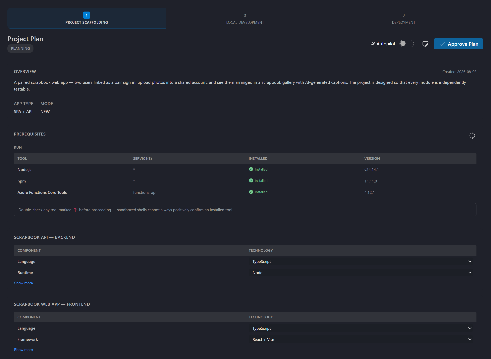

  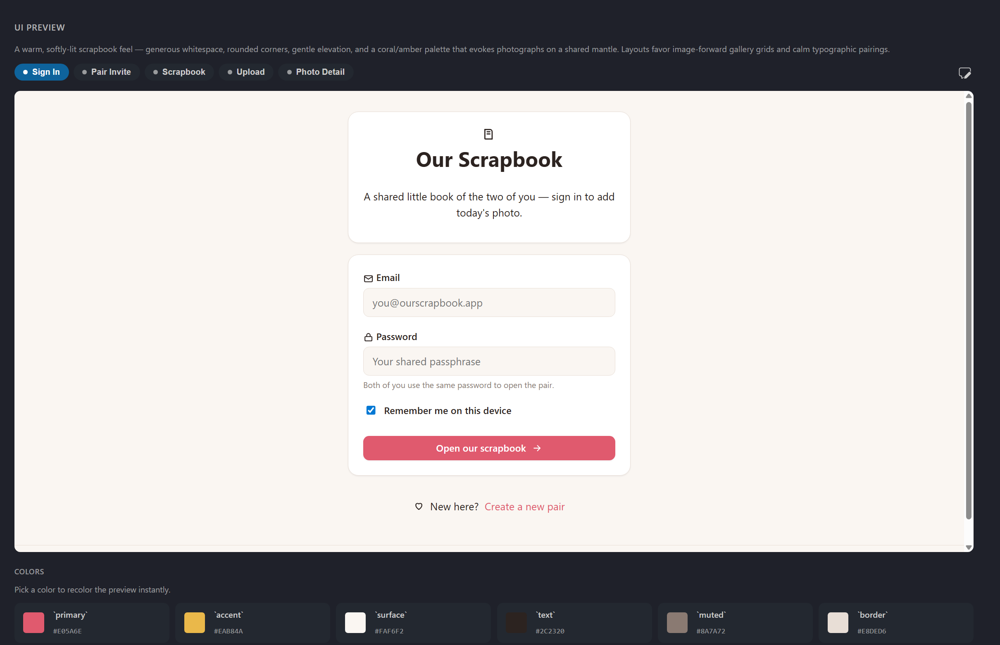

Approving flips the plan to `**Status**: Approved` and hands off to **`azure-project-scaffold`** via the
`start_project_scaffold` tool.

## Stage 4 — Scaffold & approve the UI

The scaffold agent reads the approved plan and generates the frontend, backend, database, and API routes.
When it finishes, for apps **with a frontend** it writes `.azure/integration-plan.md` and opens the
**Frontend preview** view: it starts your app's dev server and renders the running app (with mock data) inside
an iframe, topped by an **Approve UI** header and a feedback box.

- Click **Approve UI** to continue — this calls `copilotOnRails.startProjectIntegrate` and hands off to
  integration.
- Or type UI change requests in the feedback box to re‑open the scaffold agent; the dev server hot‑reloads as
  edits land.

  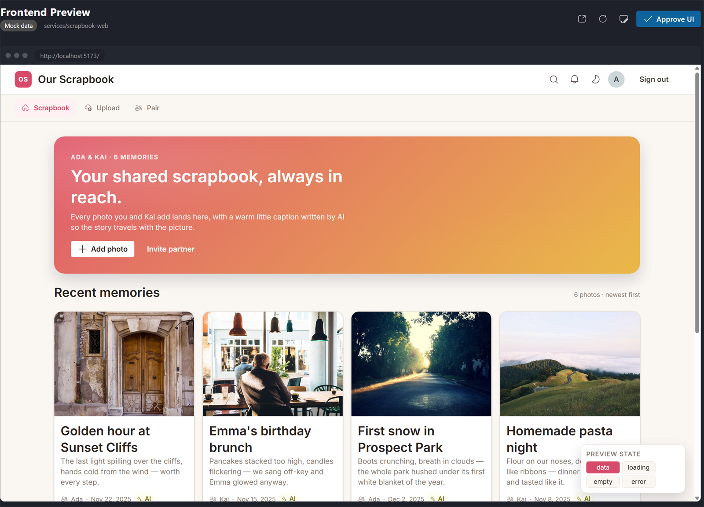

> [!IMPORTANT]
> The Frontend preview **owns the single dev server** on the preview port. Don't start your own
> `npm run dev` while the preview is open — a second server contends for the port and can leave the preview
> stuck on *"Starting…"* even though the app loads fine in a normal browser. If it's stuck, stop any
> manually‑started dev servers, free the port, and reopen the preview.

For apps **with no frontend**, the preview gate is skipped and the scaffold agent hands off to integration
directly via `start_project_integrate`.

## Stage 5 — Integration

The **`azure-project-integrate`** agent runs in a fresh session and reads `.azure/integration-plan.md`. It:

- Creates the database **schema migrations** (tables, constraints, indexes) — **schema only, no seed data**.
- **Wires the frontend to live backend data**, replacing all mock data.
- **Smoke‑tests the backend** so every endpoint responds.
- Runs the frontend and backend together end‑to‑end.

When done it opens the **Scaffold Next Steps** view — a "What's next?" card that drives the next hand‑off
(set up **Local Development**, or **Deploy**).

  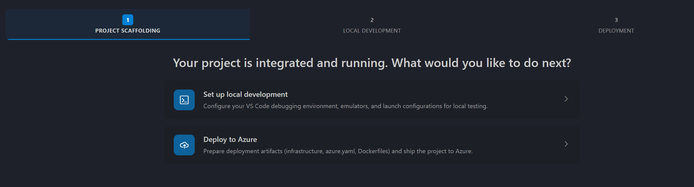

## Stage 6 — Local development (debug)

Choosing **Local Development** starts **`azure-debug-plan`**, which scans the project, classifies its services
and dependencies, and writes `.azure/vscode-debug-plan.md`. After you approve, **`azure-debug-generate`**
produces the debugging artifacts — `docker-compose` for emulators, VS Code `launch.json` / `tasks.json`, and
API tests — then opens the **Debug Next Steps** view.

  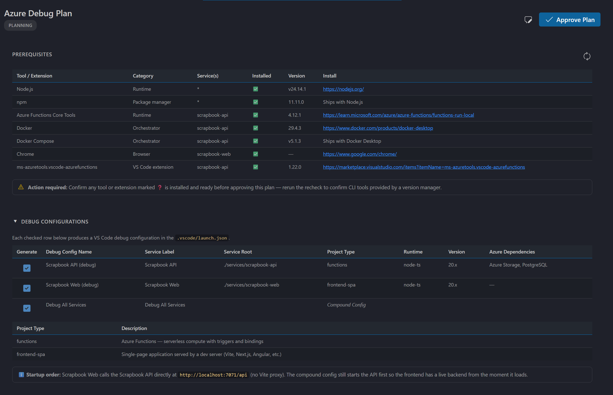

  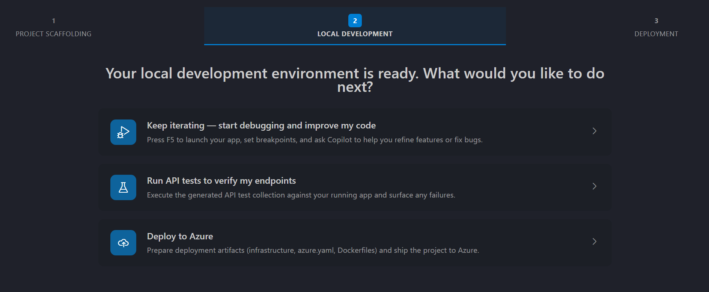

## Stage 7 — Deploy to Azure

Choosing **Deploy** starts **`azure-deploy`**, which writes its structured plan to
`.azure/prepare-plan.json` (or, when it runs with a deploy session, to
`.copilot-azure/sessions/{id}/prepare-plan.json`) and opens the **Deployment plan** view. The view renders the
planned Azure services (with editable SKUs), the cost estimate and its breakdown, and post-deploy
recommendations. After you approve, it generates the infrastructure (Bicep/Terraform), `azure.yaml`,
and Dockerfiles, then validates them with `azd package`. You deploy with `azd up`.

  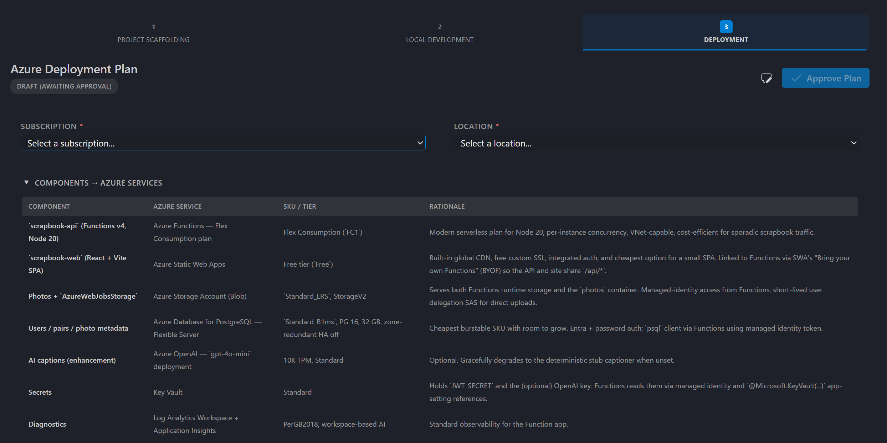

### Knowing what was created (and cleaning up after a failure)

Deploying real Azure resources means a failed or partially-completed deployment can leave resources behind. To
make this deterministic rather than a guess, the deploy agent records **exactly which resources this session
created** by snapshotting your subscription with the Azure Resource Manager API **before** the first
deployment and **after** each attempt, then diffing the two lists. Whatever is present afterward but not
before was created by this run.

Each created resource is classified as **expected**, **failed**, or **orphaned** (created outside the final
target resource group — for example by a retry that fell back to a new region — or created but never claimed
by a successful deployment). The results are recorded in the deploy result (`deploy-result.json`) and, on any
failure, surfaced in chat with copy‑paste `az` delete commands so you can remove leftovers. The baseline is
held in memory during the deploy — no extra files are written to your workspace. Nothing is ever deleted
automatically — the capture only reports. See [Clean up resources after a failed deploy](#clean-up-resources-after-a-failed-deploy).

When the deploy finishes, the agent writes `deploy-result.json` and opens the **Deployment results** view —
a read-only report of what actually shipped: status and health, the live endpoints, the Azure resources that
were created (including their inventory classification and provisioning state), any recovery attempts made
along the way, and the command that deletes everything again. It
opens on failure too, so you can see which resources or endpoints didn't make it. You can reopen it any time
with **Azure: Open Deploy Results View**.

> 📷 *Screenshot needed: the Deployment results view after a successful deploy.*

  

## Resuming a session

The flow remembers where you left off in a workspace, through two affordances:

- **A resume notification.** When you open a workspace that has an in‑progress Copilot project, the extension
  proactively shows a notification — *"You have an in‑progress Copilot project (&lt;phase&gt;). Would you like to
  resume?"* — with **Resume** / **Not now** (Source: **Azure Resources**). **Resume** picks the flow back up at
  the recorded phase.
- **The launch command.** Re‑running **Create New Project With Copilot** in a workspace with prior progress
  detects it and offers to continue instead of starting over:
  - **Fully scaffolded project detected** → *"How would you like to proceed?"* → **Local Development** or **Deploy**.
  - **Completed local debug configuration detected** → *"Would you like to deploy this project?"* → **Deploy**.

  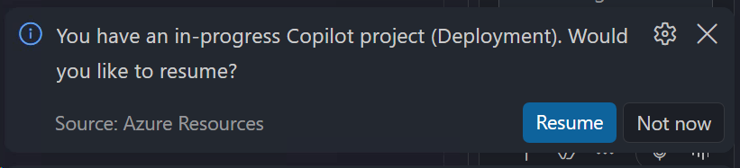

Progress is also visible in the **Azure Project** view, which shows the pipeline stages (Create → Local
Development → Deploy) and their status.

  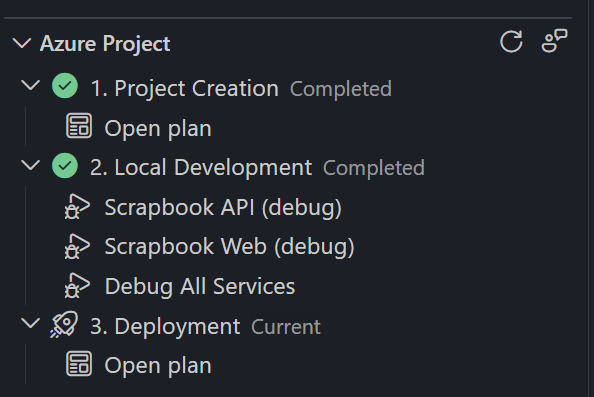

## Autopilot mode

Autopilot runs the whole pipeline **unattended** — no approval gates, no Next Steps prompts. It activates when
the invoking chat query begins with the marker `[AUTOPILOT MODE]`, **or** when `.azure/project-plan.md`
includes an `**Execution Mode**: auto` metadata row. In autopilot, agents hand off directly (e.g. scaffold →
`start_project_integrate` → `start_local_development`) and skip the Frontend preview and Next Steps views.

---

# Part 3 — UI surfaces reference

| Surface | Command to open | Opened by (MCP tool) | Purpose |
| --- | --- | --- | --- |
| **Create with Copilot** prompt | `copilotOnRails.createProjectWithCopilot` | — (view controller) | Enter the project description + model, press **Plan**. |
| **Requirements** view | `copilotOnRails.openRequirementsView` | `open_requirements_view` | Answer per‑service + shared questions; **Submit**. |
| **Plan preview** view | `copilotOnRails.openScaffoldPlanView` | `open_plan_view` | Review the plan + UI preview cards; **Approve**. |
| **Frontend preview** (Approve UI) | `copilotOnRails.openFrontendPreviewView` | `open_frontend_preview_view` | See the running app (mock data); **Approve UI**. |
| **Scaffold Next Steps** view | `copilotOnRails.openScaffoldNextStepsView` | `open_scaffold_next_steps_view` | Post‑integration "What's next?" (local dev / deploy). |
| **Debug plan** view | `copilotOnRails.openDebugPlanView` | `open_local_plan_view` | Review the local debug configuration; approve. |
| **Debug Next Steps** view | `copilotOnRails.openDebugNextStepsView` | `open_local_next_steps_view` | Post‑debug "What's next?" (deploy / run tests). |
| **Deployment plan** view | `copilotOnRails.openDeploymentPlanView` | `open_deploy_plan_view` | Review the deployment plan; approve. |
| **Deployment results** view | `copilotOnRails.openDeployResultView` | `open_deploy_result_view` | Read-only report of a finished deploy: status, endpoints, resources, cleanup. |
| **Azure Project** progress tree | `azureProject.refresh` (refresh) | — (tree data provider) | Stage‑based progress of the whole pipeline. |

> The `openScaffoldPlanView`, `openFrontendPreviewView`, `openScaffoldNextStepsView`, `openDebugPlanView`,
> `openDebugNextStepsView`, `openDeploymentPlanView`, and `openDeployResultView` commands are also available from the Command
> Palette, primarily for support/debugging (they open the view for the current workspace's artifacts).

---

# Part 4 — How it works

## The agents

Six agents form the pipeline. Each is a `*.agent.md` under [`resources/agents/`](../resources/agents/); their
step‑by‑step instructions live in the sibling folders and are copied into your workspace at
`.github/agents/` before they run.

| # | Agent | Reads | Writes | Hands off with |
| --- | --- | --- | --- | --- |
| 1 | `azure-project-plan` | your prompt | `.azure/requirements.json`, `.azure/project-plan.md` | `start_project_scaffold` |
| 2 | `azure-project-scaffold` | `.azure/project-plan.md` | project source, `.azure/integration-plan.md` | `start_project_integrate` (or Approve UI) |
| 3 | `azure-project-integrate` | `.azure/integration-plan.md` | migrations, live‑wired frontend | `start_local_development` |
| 4 | `azure-debug-plan` | project source | `.azure/vscode-debug-plan.md` | `start_azure_debug_generate` |
| 5 | `azure-debug-generate` | `.azure/vscode-debug-plan.md` | `docker-compose`, `.vscode/launch.json` + `tasks.json`, API tests | `start_deployment` |
| 6 | `azure-deploy` | project source | `.copilot-azure/sessions/{id}/prepare-plan.json`, Bicep/Terraform, `azure.yaml`, Dockerfiles | `azd up` |

Agent instructions are **version‑stamped**. A `.version` file next to the copied folders records the
extension version that wrote them; if it doesn't match the running extension, the folders are refreshed
silently so a stale copy can't make an agent follow outdated steps.

## The MCP tools

The extension exposes these tools to Copilot through the `vscode-azureresourcegroups.mcp` server
("Copilot Azure Resources Extension Tools"). Agents call them to open views and trigger the next stage.

| Tool | Effect |
| --- | --- |
| `open_requirements_view` | Opens the Requirements view. |
| `open_plan_view` | Opens the Plan preview view. |
| `open_frontend_preview_view` | Starts the frontend dev server and opens the Approve‑UI preview. |
| `open_scaffold_next_steps_view` | Opens the post‑integration Next Steps view. |
| `open_local_plan_view` | Opens the Debug plan view. |
| `open_local_next_steps_view` | Opens the post‑debug Next Steps view. |
| `open_deploy_plan_view` | Opens the Deployment plan view. |
| `open_deploy_result_view` | Opens the Deployment results view. The deploy agent calls this at handoff, once `deploy-result.json` is finalized. |
| `start_project_scaffold` | Starts the `azure-project-scaffold` agent in a new session. |
| `start_project_integrate` | Starts the `azure-project-integrate` agent in a new session. |
| `start_local_development` | Starts the `azure-debug-plan` agent in a new session. |
| `start_azure_debug_generate` | Starts the `azure-debug-generate` agent in a new session. |
| `start_deployment` | Starts the `azure-deploy` agent in a new session. |
| `capture_deployment_inventory` | Snapshots the subscription's Azure resources (baseline before deploy, capture after) and diffs them to record what the session created and classify orphaned/failed resources. Report‑only — never deletes; the agent builds cleanup commands from its output. |

## Files & state

Everything the flow produces lives in the workspace, so it's inspectable and reversible.

| Path | Written by | Contents |
| --- | --- | --- |
| `.azure/requirements.json` | plan agent | Structured requirements answers (statuses: inferred / needs_input / confirmed). |
| `.azure/project-plan.md` | plan agent | The plan. `**Status**:` moves `Planning` → `Approved`; may include `**Execution Mode**: auto`. |
| `.azure/.preview-temp/{theme.css, manifest.json, *.html}` | plan agent | Per‑screen UI preview pages rendered in the Plan view. |
| `.azure/integration-plan.md` | scaffold agent | Brief the integrate agent consumes. |
| `.azure/vscode-debug-plan.md` | debug‑plan agent | The local debug configuration plan. |
| `.azure/prepare-plan.json` (or `.copilot-azure/sessions/{id}/prepare-plan.json`) | deploy agent | The structured deployment plan. The Deployment plan view renders its services, cost estimate, and post-deploy recommendations. |
| `.azure/deploy-result.json` *or* `.copilot-azure/sessions/{id}/deploy-result.json` | deploy agent | Result of the deploy: status, endpoints, health, resources, recovery attempts. Backs the Deployment results view. A workspace can hold several — the session named by `.copilot-azure/sessions/active-session.json` wins, falling back to the newest file. |
| `.github/agents/**` (+ `.version`) | extension | Copied agent instruction files and the version stamp. |

Session/diagnostics state is kept in VS Code **workspaceState** (not files): `copilotOnRails.prompt`,
`copilotOnRails.createdAt`, and `copilotOnRails.diagnosticEvents` (see below).

---

# Part 5 — Support & triage runbook

This part is for anyone diagnosing or triaging a *Create New Project with Copilot* report.

## Report an issue

The **Azure Project** view title bar has a **Report Issue** action (command `copilotOnRails.reportIssue`). It:

1. Gathers the workspace‑cached diagnostics (see [below](#what-the-diagnostics-contain-privacy)).
2. **Copies** an issue template — containing those diagnostics inside a collapsible `Diagnostics data`
   `
` block — to the clipboard.
3. Opens GitHub's **new issue** form at `https://github.com/microsoft/vscode-azureresourcegroups/issues/new`
   with a placeholder body telling the user to paste.

The user then **pastes, reviews, redacts, and submits** the issue themselves. Diagnostics travel via the
clipboard (not the URL) because they routinely exceed GitHub's prefilled‑body length limit — and, critically,
**nothing is submitted automatically**.

  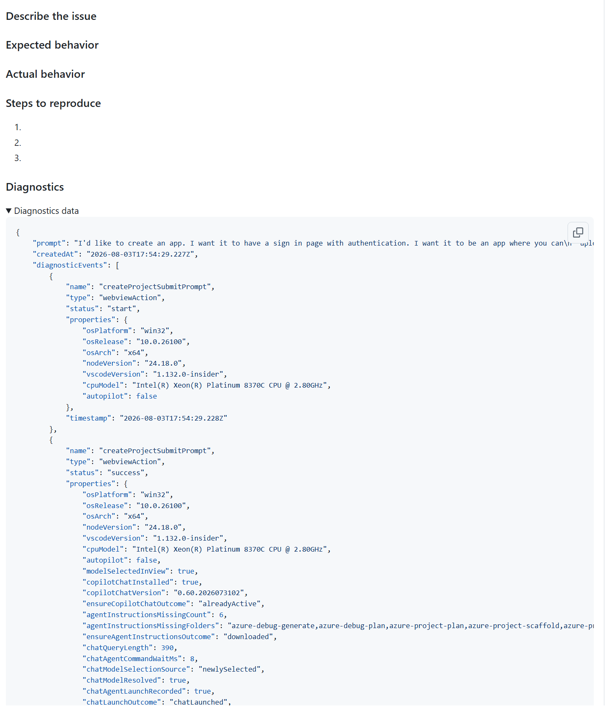

If no diagnostics exist yet, the command shows *"No Copilot on Rails diagnostics have been recorded for this
workspace yet."* and does nothing else — expected in a workspace where the flow never ran.

## Inspect diagnostics

**Inspect Copilot on Rails Diagnostics** (Command Palette → command `copilotOnRails.inspectDiagnostics`) opens
the workspace‑cached diagnostics as a **read‑only JSON document** — the same payload Report Issue embeds. Use
it to see the originating prompt, the created‑at stamp, and the recent event log without opening a GitHub
issue.

  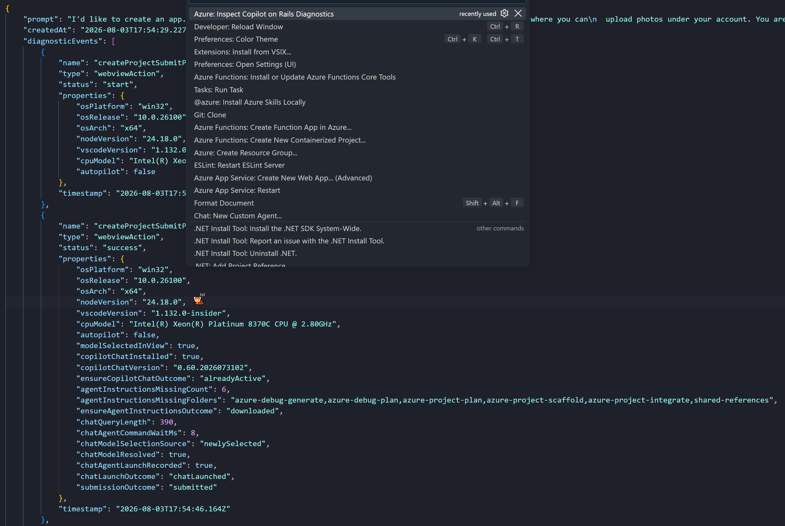

## What the diagnostics contain (privacy)

The diagnostics object has exactly three fields:

| Field | Value |
| --- | --- |
| `prompt` | The project description the user typed. |
| `createdAt` | ISO‑8601 timestamp of when the project was first prompted. |
| `diagnosticEvents` | Up to the **50 most recent** events, each: `timestamp`, `name` (command/tool), `type` (`extensionCommand` \| `mcpTool` \| `webviewAction`), `status` (`start` \| `success` \| `error`), and a `properties` bag. Error messages are **masked** before being recorded. |

Privacy guarantees, by design:

- Diagnostics are **workspace‑cached only** (VS Code `workspaceState`).
- They are **never sent to telemetry** and **never submitted anywhere** on the user's behalf.
- They are surfaced **only** to pre‑populate a GitHub issue draft (which the user reviews/redacts) or the
  read‑only inspector.
- Correlating identifiers (project id, Copilot session/request ids) are deliberately **excluded** so the
  draft can't be tied back to a user.

When triaging, always ask the reporter to confirm they reviewed and redacted the `Diagnostics data` block
before submitting.

## Common problems & fixes

| Symptom | Likely cause | Fix |
| --- | --- | --- |
| *"Creating a project with Copilot requires an empty folder."* | The open folder isn't empty. | Click **Browse…** and pick an empty folder; VS Code reopens there and resumes. |
| An agent says it needs its instruction files, or behaves oddly / follows outdated steps. | `.github/agents/` is missing or stale. | Accept the download prompt, or run **Download Azure Agent Instructions**. The version stamp auto‑refreshes stale copies. |
| Frontend preview stuck on *"Starting…"*; **Approve UI** never enables (but the app loads in a normal browser). | A second dev server is contending for the preview port. | Stop **all** manually‑started dev servers, free the port, ensure the frontend's `vite.config` is the clean minimal version, then reopen the preview and let it own the server. Don't verify by starting your own server. |
| Plan preview shows *"couldn't render this plan — didn't match the expected layout."* | `.azure/project-plan.md` diverged from the required numbered skeleton. | The plan agent must rewrite the plan to the exact template (numbered `## N.` headings, `**Status**` / `**Created**` / `**Mode**` rows, a `## 6. Design System & UI` section with a `**Component Library**:` row). |
| The flow doesn't advance after an approval. | An agent didn't successfully call its hand‑off MCP tool. | Check the diagnostics event log for a missing `start_*` event; re‑trigger the stage. Agents must load a tool via `tool_search` → `activate_tools` if it isn't directly listed. |
| **Report Issue** / **Inspect Diagnostics** say "No … diagnostics … recorded." | The flow never ran in this workspace, or state was reset. | Expected. Reproduce the issue in this workspace first so events are recorded. |
| Requirements view never opens / opens empty. | `.azure/requirements.json` was written to the wrong path (e.g. a leading dot). | The file must be exactly `.azure/requirements.json` (no leading dot on the filename); the watcher and `openRequirementsView` look for that path. |
| A deploy failed and you're unsure what Azure resources it left behind. | Partial or healing‑retry deployment created resources that aren't the final target. | Check the failure message in chat (or `deploy-result.json.createdResources[]`) and run the listed cleanup commands. See [Clean up resources after a failed deploy](#clean-up-resources-after-a-failed-deploy). |

## Clean up resources after a failed deploy

Because deploying creates real Azure resources, the deploy agent tracks them deterministically instead of
relying on the model's memory. It snapshots your subscription with the ARM API **before** the first
deployment (kept **in memory** — no files are written to your workspace) and again **after** each attempt,
then diffs the two lists — anything new is a resource this session created.

Where to look, in order:

1. **The chat handoff / failure message.** On both success and failure, the agent surfaces a cleanup section
   with copy‑paste `az` commands. On a failed or aborted deploy this is printed before it stops.
2. **`deploy-result.json` (in the App Onboard session folder).** Its `createdResources[]` lists each created
   resource classified `expected` / `failed` / `orphaned`, and `orphanedResourceGroups[]` lists the resource
   groups left behind by healing retries. The agent writes these from the capture's output.

Cleanup patterns the agent emits (run them yourself — the capture **never deletes anything**):

- **Whole orphaned resource group:** `az group delete --name {rg} --subscription {sub} --yes --no-wait`
- **Individual leftover resource:** `az resource delete --ids {resourceId} --subscription {sub}`
- **Everything from the session (tag‑based):**
  `az group list --tag app-onboard-session-id={id} --query "[].name" -o tsv | ForEach-Object { az group delete -n $_ --yes --no-wait }`

The baseline lives in memory only, so if VS Code is reloaded mid‑deploy the agent can re‑run
`capture_deployment_inventory` with `phase: "capture"`, but without a baseline it treats every current
resource as new and may over‑report — so a clean run always captures the baseline before deploying.

## Re‑download agent instructions

Run **Download Azure Agent Instructions** (Command Palette → `copilotOnRails.downloadAgentInstructions`) to
force‑copy the bundled instruction folders into `.github/agents/` and refresh the version stamp. Running the
command is treated as explicit consent to write there (no prompt). Requires an open folder/workspace.

## Reset a workspace's state

To reproduce a clean run or clear a stuck state:

- **Artifacts:** delete the `.azure/` folder (and `.github/agents/` to force a fresh instruction download).
- **Cached diagnostics/session state** live in VS Code `workspaceState` (`copilotOnRails.prompt`,
  `copilotOnRails.createdAt`, `copilotOnRails.diagnosticEvents`). The most reliable reset is to run the flow
  in a **fresh empty folder**, which starts brand‑new state.

> Deleting `.azure/` and `.github/agents/` is destructive to in‑progress work. Confirm with the user before
> removing them, and prefer a fresh folder for repro.

## Escalation checklist

Collect before escalating a bug:

1. Extension version (from the VS Code Extensions view) and VS Code version.
2. The **Inspect Diagnostics** JSON (redacted), or the pasted `Diagnostics data` block from the issue.
3. Which **stage** failed (plan / scaffold / integrate / debug / deploy) and the last successful hand‑off.
4. The relevant `.azure/*` artifact(s) for that stage.
5. Whether **autopilot** was active (`[AUTOPILOT MODE]` marker or `**Execution Mode**: auto`).
6. Screenshots of the failing view.

---

# Appendix — reference tables

## Commands

| Title | Command id |
| --- | --- |
| Create New Project With Copilot | `copilotOnRails.createProjectWithCopilot` |
| Download Azure Agent Instructions | `copilotOnRails.downloadAgentInstructions` |
| Open Project Requirements View | `copilotOnRails.openRequirementsView` |
| Open Scaffold Plan View | `copilotOnRails.openScaffoldPlanView` |
| Open Frontend Preview View | `copilotOnRails.openFrontendPreviewView` |
| Open Scaffold Next Steps View | `copilotOnRails.openScaffoldNextStepsView` |
| Open Debug Plan View | `copilotOnRails.openDebugPlanView` |
| Open Debug Next Steps View | `copilotOnRails.openDebugNextStepsView` |
| Open Deploy Plan View | `copilotOnRails.openDeploymentPlanView` |
| Open Deploy Results View | `copilotOnRails.openDeployResultView` |
| Report Issue | `copilotOnRails.reportIssue` |
| Inspect Copilot on Rails Diagnostics | `copilotOnRails.inspectDiagnostics` |
| Refresh (Azure Project view) | `azureProject.refresh` |

## Agents & instruction folders

| Agent | Definition | Instruction folder (copied to `.github/agents/`) |
| --- | --- | --- |
| `azure-project-plan` | `resources/agents/azure-project-plan.agent.md` | `azure-project-plan/` |
| `azure-project-scaffold` | `resources/agents/azure-project-scaffold.agent.md` | `azure-project-scaffold/` |
| `azure-project-integrate` | `resources/agents/azure-project-integrate.agent.md` | `azure-project-integrate/` |
| `azure-debug-plan` | `resources/agents/azure-debug-plan.agent.md` | `azure-debug-plan/` |
| `azure-debug-generate` | `resources/agents/azure-debug-generate.agent.md` | `azure-debug-generate/` |
| `azure-deploy` | `resources/agents/azure-deploy.agent.md` | *(shared)* `shared-references/` |

## Related docs

- [Extension README](../README.md)
- [Azure Resources API README](../api/README.md)
- [SUPPORT.md](../SUPPORT.md) · [CHANGELOG.md](../CHANGELOG.md)
