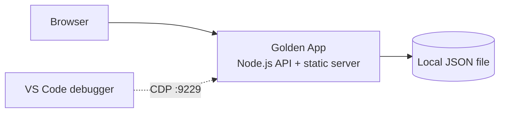

# Azure Debug Plan

> **Status:** Implemented
> **Execution Mode:** Auto
> **Created:** 2026-08-07T00:00:00.000Z
> **Last Updated:** 2026-08-07T00:00:00.000Z

## Prerequisites

| Tool | Required Version | Installed | Action Required |
|---|---|---|---|
| Node.js | 22.x | ✅ | None |
| npm | 10.x | ✅ | None |

## Debug Configurations

| Generate | Debug Config Name | Service Label | Service Root | Project Type | Runtime | Version | Azure Dependencies |
|---|---|---|---|---|---|---|---|
| [x] | Golden App (debug) | Golden App | `.` | Backend | Node.js | 22.x | None |

## Orchestrator

| Orchestrator | Selected | Notes |
|---|---|---|
| VS Code task and launch configuration | Yes | Single service, so no compound configuration is required. |

## Emulators

No emulators are required. The app persists to a local JSON file, so no containerized dependency is started.

## Architecture Diagram

## Convenience Scripts

| Generate | Script | Registered In | Purpose |
|---|---|---|---|
| [x] | start | ./package.json | Run the Golden App outside the debugger. |

## API Test Collections

| Generate | Service | Endpoints | Notes |
|---|---|---|---|
| [x] | Golden App | GET /api/health | Health probe used to confirm the service is listening. |

## Debug Configuration Checklist

Debug Configuration Checklist:
✅ Golden App (debug) — Ready signal `Server listening on :3000` observed on the `prepare` task chain; `curl http://localhost:3000/api/health` → `200`; CDP inspector metadata available on `ws://127.0.0.1:9229`.
✅ Golden Project Tracker — Browser interaction and accessibility checks passed against the served UI at `http://localhost:3000`.
✅ Persistence — Created project remained visible after restarting the service, confirming the local JSON store is written through.
