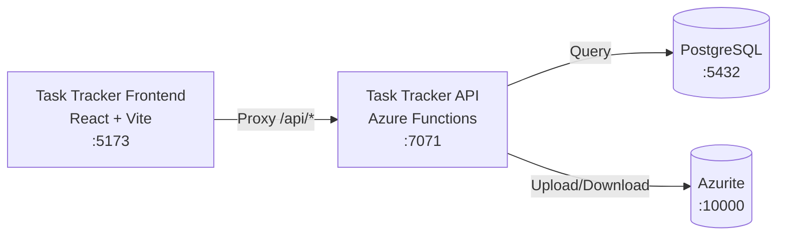

# Azure Debug Plan

> This plan is the source of truth for generating the
> VS Code debug setup in this workspace.
>
> **Status:** Planning
> **Execution Mode:** Guided
> **Created:** 2026-08-31T00:00:00Z
> **Last Updated:** 2026-08-31T00:00:00Z
>
> <!-- Guided Mode (default) - hand-holds the user through review and approval before generating. -->

---

## Prerequisites

All required tools and VS Code extensions with install status — list both the Run and Debug tool sets.

| Tool / Extension | Category | Service(s) | Installed | Version |
|------------------|----------|------------|-----------|---------|
| Node.js | Runtime | * | ✅ | 22.23.2 |
| npm | Package Manager | * | ✅ | — |
| Azure Functions Core Tools | Runtime | functions | ✅ | 4.14.0 |
| TypeScript | Build Tool | * | ✅ | — |
| Docker | Container Runtime | * | ❓ | — |
| Docker Compose | Orchestration | * | ❓ | — |
| ms-azuretools.vscode-azurefunctions | VS Code Extension | functions | ❓ | — |
| dbaeumer.vscode-eslint | VS Code Extension | * | ❓ | — |

> ⚠️ **Action required:** Confirm any tool or extension marked ❓ is installed and ready before approving this plan — rerun the recheck to confirm CLI tools provided by a version manager.

---

## Debug Configurations

Each checked row below produces a VS Code debug configuration in the `.vscode/launch.json`.

| Generate | Debug Config Name | Service Label | Service Root | Project Type | Runtime | Version | Azure Dependencies |
|----------|-------------------|---------------|--------------|--------------|---------|---------|-------------------|
| [x] | Task Tracker API (debug) | functions | services/functions | functions | node-ts | 22.x | Azure Storage, PostgreSQL |
| [x] | Task Tracker Frontend (debug) | web | services/web | frontend-spa | node-ts | 22.x | — |
| [x] | Debug All Services | — | — | *Compound Config* | — | — | — |

ℹ️ Project Type Descriptions

| Project Type | Description |
|-------------|-------------|
| functions | Azure Functions — serverless compute with triggers and bindings |
| frontend-spa | Single-page application served by a dev server (Vite, Next.js, Angular, etc.) |

> ℹ️ **Proxy detected:** Task Tracker Frontend will need to proxy requests to Task Tracker API (configure in `vite.config.ts`). The compound config should start backends before frontends.

---

## Orchestrator

| Orchestrator | Description |
|-------------|-------------|
| Docker Compose | Uses Docker Compose to orchestrate emulators and dependent services during local development |

---

## Emulators

| Dependent Service | Emulator | Purpose |
|-------------------|----------|---------|
| Azure Storage | Azurite Container | Blob storage for task attachments |
| PostgreSQL | PostgreSQL Container | Relational database for task records |

---

## Architecture Diagram

The Task Tracker API connects to PostgreSQL for task storage and Azure Storage (Azurite) for attachments. The frontend proxies API requests to the Functions backend.

---

## Migrations

When selected, the generation phase creates automated VS Code tasks that run migration scripts on launch — so emulator databases are automatically provisioned with the correct schema and seed data before the app starts debugging. No manual migration steps needed.

| Generate | Service | Migration Tool |
|----------|---------|---------------|
| [x] | functions | Raw SQL |

> ℹ️ **Note:** Migration files will be created in `services/functions/migrations/` with the `tasks` table schema.

---

## API Test Collections

When selected, the generation phase produces lightweight, runnable API test scripts in the project so you can quickly smoke-test endpoints and triggers once everything is launched and connected locally.

| Generate | Service | Description |
|----------|---------|-------------|
| [x] | functions | 

HTTP Endpoints (4)
 GET /api/health GET /api/tasks POST /api/tasks GET /api/openapi
 |

---

## Convenience Scripts

| Generate | Script | Registered In | Description |
|----------|--------|---------------|-------------|
| [x] | emulators:start | ./package.json | Start all emulators in the background, preserving existing data |
| [x] | emulators:stop | ./package.json | Stop all running emulators |
| [x] | emulators:clean | ./package.json | Stop emulators and delete all data (fresh start) |
| [x] | db:migrate | ./services/functions/package.json | Apply pending database migrations to the emulator database |
