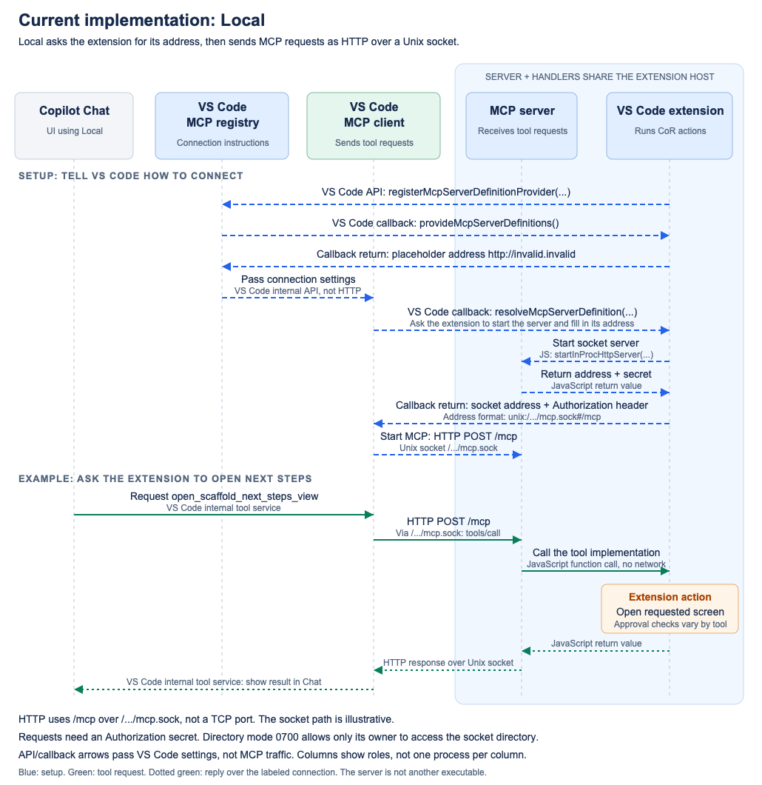
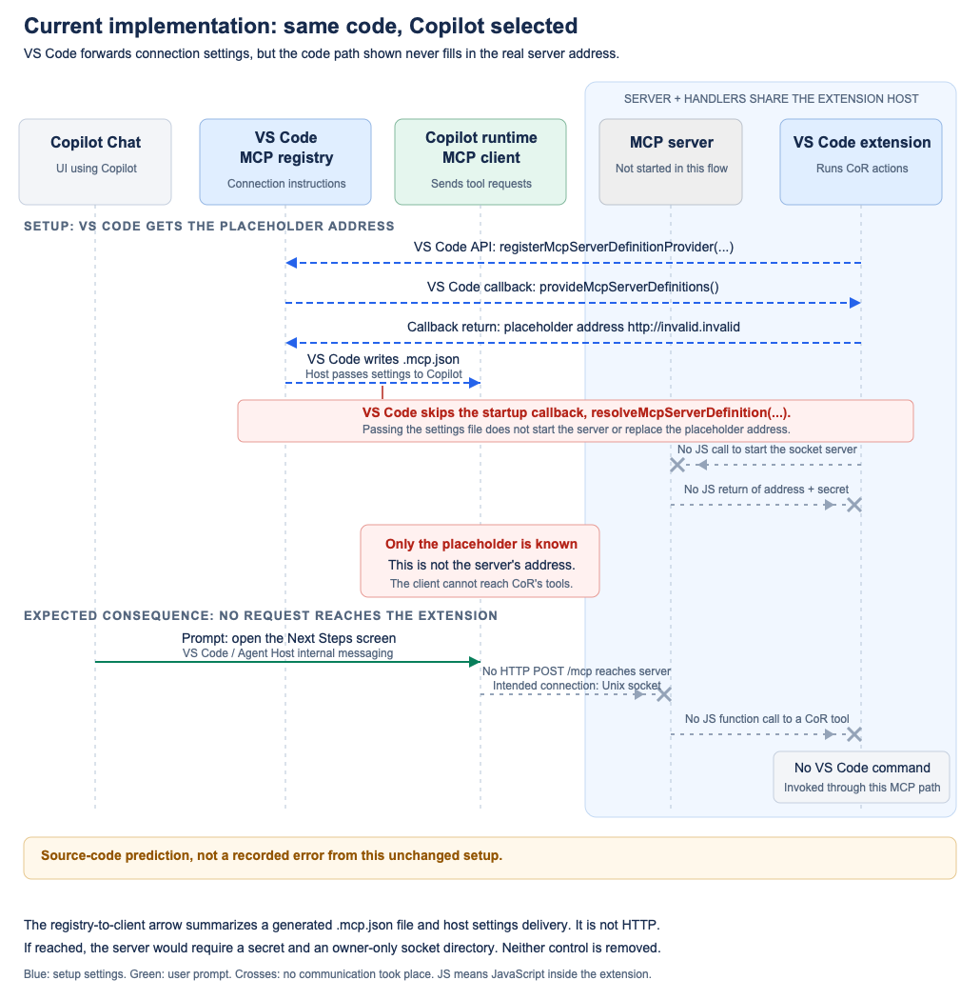

# 0. Current implementation

This describes the existing `feat/CoR` implementation. Copilot on Rails tools run inside the Azure Resource Groups extension. VS Code's **Local** chat client reaches them by sending MCP requests as HTTP over a private Unix socket.

"In-process MCP" describes where the server runs: inside the extension-host process, alongside the extension's other code. It does not mean that the client calls the tools directly in memory. There is still a socket connection carrying HTTP requests.

## Baseline at a glance

| Part | What we already have |
| --- | --- |
| Server | `@microsoft/vscode-inproc-mcp` 1.0.0, loaded inside the extension host. |
| Tools | 17 CoR tools, plus `get_azure_activity_log`. |
| Registration | The extension supplies connection instructions through VS Code's MCP provider API. |
| Connection owner | VS Code's built-in MCP client when the chat uses Local. |
| Communication | HTTP over a Unix socket on the tested Mac. No TCP port or separate bridge process. |
| Command execution | The server calls the registered tool's JavaScript implementation inside the extension. No general-purpose command dispatcher. |

The package also supports Windows named pipes in source. The [recorded trials](README.md#evidence-boundary) exercised macOS sockets, not Windows or remote environments.

## How Local starts the server and calls a tool

1. **Register the provider.** During activation, `src/extension.ts` calls `registerMcpHttpProvider`. That helper uses VS Code's `registerMcpServerDefinitionProvider` API. Its initial `provideMcpServerDefinitions()` result contains `http://invalid.invalid`, a deliberate placeholder rather than a usable server address.
2. **Start the server when needed.** Before Local connects, VS Code calls `resolveMcpServerDefinition(...)`. This callback starts the private HTTP server and returns its socket address and a temporary secret in an Authorization header. Registration and server startup are separate steps.
3. **Connect and request a tool.** Local understands the package's special socket-address format. It opens the socket, initializes MCP and lists available tools. To open Next Steps, it sends an HTTP `POST /mcp` whose JSON-RPC body names `tools/call` and `open_scaffold_next_steps_view`.
4. **Run extension code and return the result.** The MCP server calls the tool's JavaScript implementation. That code opens the VS Code screen. The result returns through HTTP over the socket, then through VS Code's internal tool service to Chat.



[SVG source](assets/00-current-local-flow.svg). The diagram labels setup APIs, socket requests and return paths separately.

For example, these settings describe HTTP over a socket, not a TCP connection to `localhost`:

```text
Server address: unix:/.../mcp.sock#/mcp
Socket path:    /.../mcp.sock
HTTP request:   POST http://localhost/mcp
Authorization: Nonce <secret>
```

The socket path and secret are placeholders here. In the server address, the part before `#` identifies the socket; `/mcp` after it is the HTTP request path.

## What happens with the same code under Copilot

Copilot uses its own MCP client rather than borrowing Local's connection. VS Code forwards the registered settings through generated `.mcp.json` configuration and host settings.

The inspected forwarding code does **not** call the provider's startup callback. That leaves Copilot with the placeholder address instead of the running server's socket address and secret.



[SVG source](assets/00-current-copilot-flow.svg). This diagram follows the inspected source code; it is not a captured runtime trace.

## Protections and limits we already have

The Unix socket directory is owner-only, mode 0700. HTTP requests need the server's temporary secret, and the SDK checks the requested host. This is not an unauthenticated local server. A secret grants connection access, not approval for every CoR action, and it does not isolate malicious code running as the same OS user.

The current package still has shared connection records within its loaded module, no explicit readiness wait before startup returns, and incomplete resource limits. Windows pipe permissions also need review. These are baseline concerns, not costs introduced solely by HTTP-over-TCP. The [security comparison](04-comparison.md#iii-security-comparison) separates inherited work from new work.

## Code references

[Activation](../src/extension.ts) calls the provider helper; [tool registration](../src/chat/tools/registerMcpTools.ts) includes the [CoR tools](../src/chat/tools/copilotOnRails/registerCopilotOnRailsTools.ts).

The [package provider source](https://github.com/microsoft/vscode-containers/blob/19fa49a6b8a8d4c2680ca2ce1140c0da252394c5/packages/vscode-inproc-mcp/src/vscode/registerMcpHttpProvider.ts#L15-L37) shows the placeholder and startup callback. [VS Code's forwarding source](https://github.com/microsoft/vscode/blob/645f29cc3176500b4b5762ba887cf2a7f0ffdf2c/src/vs/workbench/contrib/chat/browser/agentSessions/agentHost/agentHostMcpServerSupport.ts#L224-L328) explains the Copilot path. Versions and evidence limits are recorded in the [overview](README.md#evidence-boundary).
