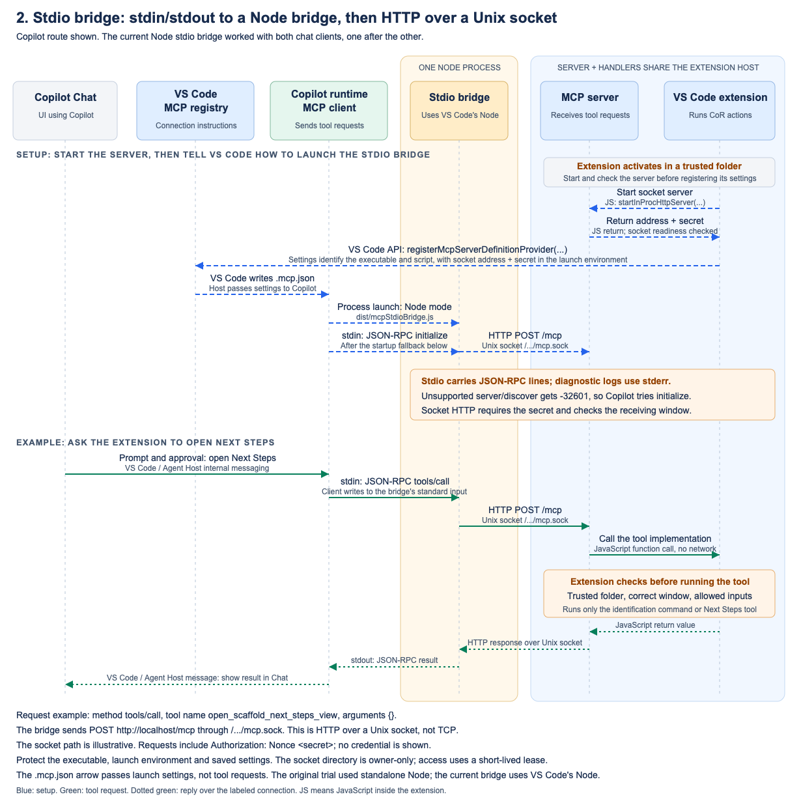

# 2. Stdio bridge

[Overview](README.md) | [Security assessment](stdio-bridge-security.md) | [Comparison](04-comparison.md)

## I. Introduction

Copilot rejected the server's Unix-socket address in experiment 1. This experiment put a Node stdio bridge process between Copilot and the existing server. Copilot talks to the bridge through its standard input and output, called stdio. The bridge talks to the extension using HTTP over the Unix socket. It changes how messages travel, not what the tools do.

## II. Hypothesis

If the stdio bridge handles the socket-specific connection, Copilot should be able to call the extension's tools through ordinary MCP stdio. A successful chat request must reach the correct VS Code window and open the existing Next Steps screen. Each request should run once, even when other test clients have already used the server.

## III. Investigation

The extension starts its existing MCP server and checks that it is ready before registering connection instructions with VS Code. Starting the server returns its socket address and temporary nonce. The extension places both values in the registered launch environment for the stdio bridge. Copilot's MCP client uses that definition to start the Node stdio bridge as a child process, so the bridge inherits the address and nonce as environment variables. Requests enter the bridge on stdin; replies leave on stdout. The bridge adds `Authorization: Nonce <secret>` when it forwards requests as HTTP over the Unix socket. It contains no CoR tools and cannot run VS Code commands itself. The extension exposes only `cor_stdio_probe`, which identifies the receiving window, and `open_scaffold_next_steps_view`, which opens the screen.

Sixteen automated scenarios checked message forwarding, cancellation, invalid input, authentication and reconnecting. Separate tests ran the actual extension commands. The first Copilot trial found a startup mismatch. Copilot asked for `server/discover`, which the older server did not support. The stdio bridge now returns the standard "method not found" response, `-32601`, so Copilot can try the supported startup request, `initialize`. It does not invent a successful response. After this correction, real Copilot Chat called the window-identification tool and opened Next Steps, once each.

The original trial used separately installed Node, the JavaScript runtime. The current code launches `process.execPath`, VS Code's executable, with `ELECTRON_RUN_AS_NODE=1` and `ELECTRON_NO_ASAR=1` to run the stdio bridge as Node. All sixteen scenarios passed with both runtimes. On September 13, real Local and Copilot chats used the same registered instructions and running server. Each returned the correct window identifier and opened Next Steps after approval. This confirms the hypothesis for both clients, used one after the other, not simultaneously. F5 needs no prototype flag or separate Node installation. It uses the normal development profile; `npm run prototype:mcp-stdio` creates a separate test profile.

## IV. Diagram of what we built

[SVG source](assets/02-stdio-bridge.svg)

The diagram shows the Node stdio bridge process and the Copilot route. The bridge receives JSON-RPC on stdin, then sends `POST http://localhost/mcp` through `/.../mcp.sock`. That socket path is illustrative, and `localhost` here does not mean TCP. Replies arrive over the socket and leave the bridge on stdout. [The security assessment](stdio-bridge-security.md#safety-of-each-transport) explains what protects each hop and what can still go wrong.

## V. Conclusion

The stdio bridge makes the existing server usable by both clients without moving CoR code or opening TCP. In [microfish91-mcp-prototype-2-stdio-bridge](ghapp://sessions/1c4fcccd-383b-44f6-a3ea-534cdce7777a), a local worktree not published to origin, BEFORE `db498b0e60aa5d306bafcd8b248fe4a8618d23e1` is the tested code; AFTER `e5384aa6ab60fc729d22705d31c99b46d6764531` adds only `docs/mcp-stdio-dual-harness-results.md`.
