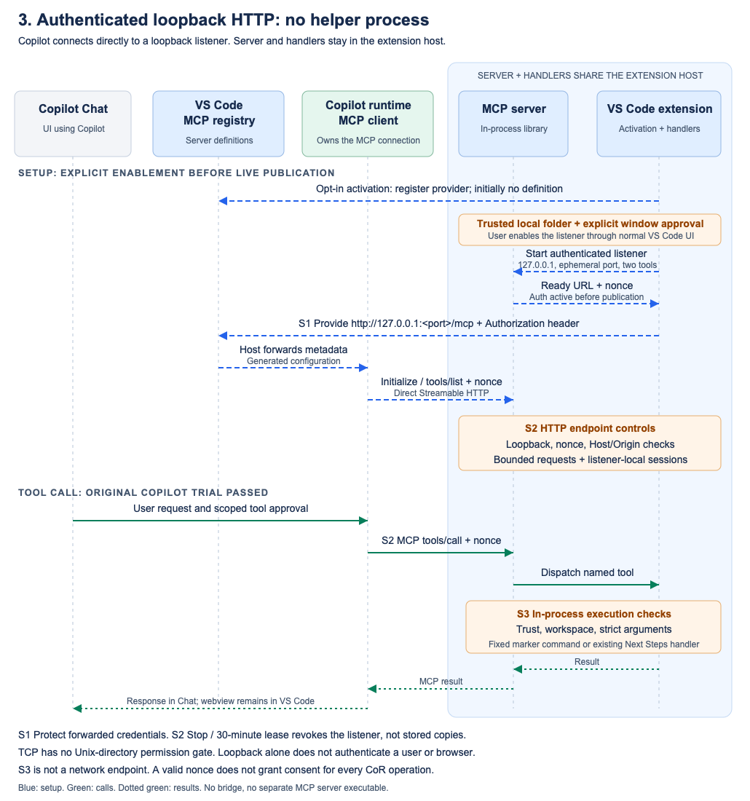

# 3. Authenticated loopback HTTP

[Overview](README.md) | [Previous: stdio bridge](02-stdio-bridge.md) | [Comparison](04-comparison.md)

## I. Introduction

An ordinary loopback HTTP URL avoids the private-socket URI mismatch without a bridge executable. The MCP server and CoR handlers still run together inside the extension host. The tradeoff is a local TCP endpoint that needs protections beyond merely binding to localhost.

## II. Hypothesis

Copilot can consume a ready HTTP definition with a nonce header, invoke a fixed command and open the existing Next Steps view through a separate approved call. Missing or wrong credentials must cause no effects, and stopping the listener must invalidate the published connection.

## III. Investigation

The opt-in provider registers during activation but publishes no definition until the user approves enablement in one trusted local folder. It starts an ephemeral `127.0.0.1` listener with authentication already active, then publishes the URL and header without a resolver placeholder. The implementation adapts the installed, locked package 1.0.0 Hono server with its MIT license retained. It does not copy the older Express source found in the primary containers checkout or assume researched upstream main matches the artifact. Listener-local sessions, Host/Origin validation, bounded requests and awaited shutdown replace the relevant package behaviors. Only `experimental_loopback_instance_marker` and `open_scaffold_next_steps_view` are exposed.

Fifteen protocol/provider checks passed. Real HTTP and SDK tests covered initialization, discovery, strict calls, unauthorized requests, two listeners, cancellation, limits and revocation; provider state was mocked. Automatic negotiation fell back to genuine initialization. The original normal Development-mode Copilot trial returned the correct marker with one command effect. A separately approved Next Steps call rendered the webview; extension diagnostics counted one start and one success. No workflow buttons were clicked. This supports the hypothesis, not a complete CoR workflow.

Live missing/wrong credentials returned 401 without effects, and Stop revoked the listener. Generated configuration retained the expired credential; revocation is not erasure. The September 13 follow-up tested unchanged BEFORE commit `493135aef262a62ebf0079348659da69fcd74930`, after the original trial's launcher cleanup. Workspace Trust completed but native window enablement did not, so no listener, HTTP definition or tool call existed in that run. Local remains TBD, not a transport failure; no fresh Copilot trial occurred. The separate SDK-only host check was also consent-blocked. Neither replaces the original real Copilot evidence.

## IV. Diagram of what we built

[SVG source](assets/03-loopback-http.svg)

No helper sits between client and server. HTTP controls apply at the listener; trust and fixed-handler checks apply inside the extension. The nonce is a same-host capability, not OAuth, user approval or same-user isolation. The original Copilot pass predates final launcher cleanup.

## V. Conclusion

Loopback HTTP remains feasible on historical Copilot evidence; Local is not yet proven. In [microfish91-mcp-loopback-http-prototype](ghapp://sessions/53f75341-2a00-4057-a1a8-a0ea4ac64317), a local worktree not published to origin, BEFORE is `493135ae` and AFTER `f546e0d5190241b2acbfda046132a48f4b240639` adds only `docs/mcp-http-dual-harness-result.md`, with no implementation changes.
