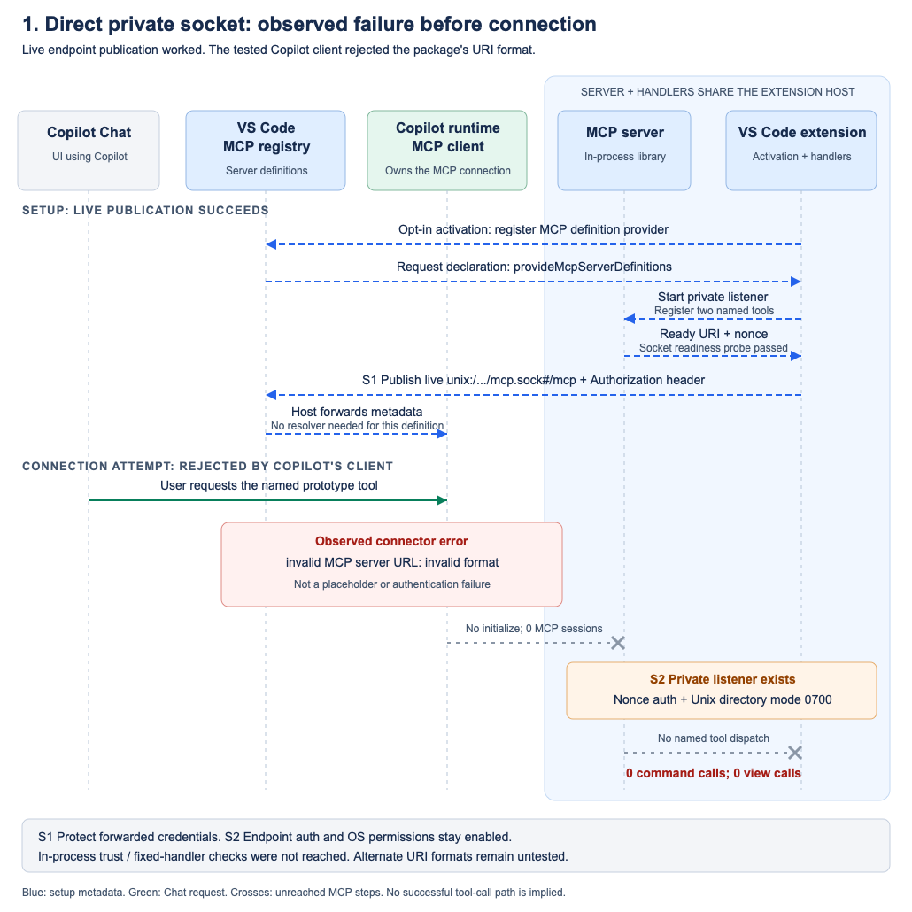

# CoR MCP transport experiments

**Stdio passed real Local and Copilot Chat command and webview calls using one definition. Loopback HTTP passed Copilot. Direct private-socket publication reached Copilot, but its URI was rejected before connecting.** These are two-tool feasibility results, not a completed Copilot on Rails migration.

The goal is to keep MCP registration and named CoR handlers in the Azure Resource Groups extension while allowing Copilot's client to invoke them. All three prototypes register through `vscode.lm.registerMcpServerDefinitionProvider` during activation. None moves VS Code commands into a standalone server or exposes arbitrary command dispatch.

| Read | Result |
| --- | --- |
| [1. Direct socket](01-direct-socket.md) | Live URI rejected; alternate-format follow-up TBD |
| [2. Stdio bridge](02-stdio-bridge.md) | Current launcher passed Local and Copilot on the same listener |
| [3. Loopback HTTP](03-loopback-http.md) | Original Copilot trial passed; Local follow-up stopped before enablement |
| [Comparison and recommendation](04-comparison.md) | Stdio preferred; full-workflow migration unproven |

## Current code

[Local](#current-local) | [Copilot](#current-copilot) | [Prototype diagrams](#prototypes)

The registry stores metadata. The active MCP client owns connection, discovery and calls. Server and handlers share the extension host; "in-process" does not mean there is no endpoint. CoR currently writes Local preference settings, but those do not override every explicit or remembered Copilot selection.

### Current Local

VS Code resolves the placeholder, starts the private listener and connects with its socket-aware MCP client. Existing protections include nonce authentication and a mode-0700 Unix socket directory.

[SVG source](assets/00-current-local-flow.svg)

### Current Copilot

The inspected forwarding path copies the declaration without invoking its resolver. The unchanged provider therefore supplies a placeholder, not a live endpoint. This is a source-predicted baseline, distinct from prototype 1's observed ready-URI rejection.

[SVG source](assets/00-current-copilot-flow.svg)

## Prototypes

### 1. Direct socket

[Report](01-direct-socket.md) | [SVG source](assets/01-direct-socket.svg). The listener existed; Copilot established no MCP session.

### 2. Stdio bridge

[Report](02-stdio-bridge.md) | [SVG source](assets/02-stdio-bridge.svg). Original Chat trial used standalone Node. Follow-up proved the current VS Code-owned child with both clients.

### 3. Loopback HTTP

[Report](03-loopback-http.md) | [SVG source](assets/03-loopback-http.svg). Ordinary HTTP, same extension-host execution. Original Copilot success predates final launcher cleanup.

Native language-model tools were considered but not built because the requirement is MCP. There is no fourth experiment.

## Evidence boundary

Original trials ran September 12, 2026, from `feat/CoR` base `5dacef3a7ddbf090717e71dc94d56112a5e4e5be`, with locked `@microsoft/vscode-inproc-mcp` 1.0.0. Follow-up ran September 13. Environment: macOS 26.6.2 arm64; VS Code 1.137.0, commit `645f29cc3176500b4b5762ba887cf2a7f0ffdf2c`; installed Copilot `1.0.84-canary.70.gdb75d0d.unsigned`, SDK `1.0.13-preview.4`; extension-host Node 24.18.1, original bridge/test Node 22.18.0. This is not the public source's Copilot `1.0.83-2`.

Package development moved from archived Docker Extensibility to [vscode-containers](https://github.com/microsoft/vscode-containers/tree/19fa49a6b8a8d4c2680ca2ce1140c0da252394c5/packages/vscode-inproc-mcp). Researched upstream source is not the installed artifact. Branch links open preserved local worktrees; none is published to origin.

Baseline sources: [package provider](https://github.com/microsoft/vscode-containers/blob/19fa49a6b8a8d4c2680ca2ce1140c0da252394c5/packages/vscode-inproc-mcp/src/vscode/registerMcpHttpProvider.ts#L15-L37), [host forwarding](https://github.com/microsoft/vscode/blob/645f29cc3176500b4b5762ba887cf2a7f0ffdf2c/src/vs/workbench/contrib/chat/browser/agentSessions/agentHost/agentHostMcpServerSupport.ts#L224-L328).
