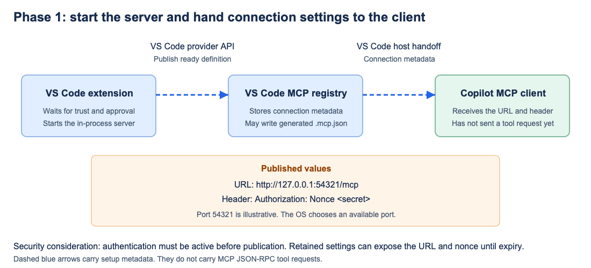
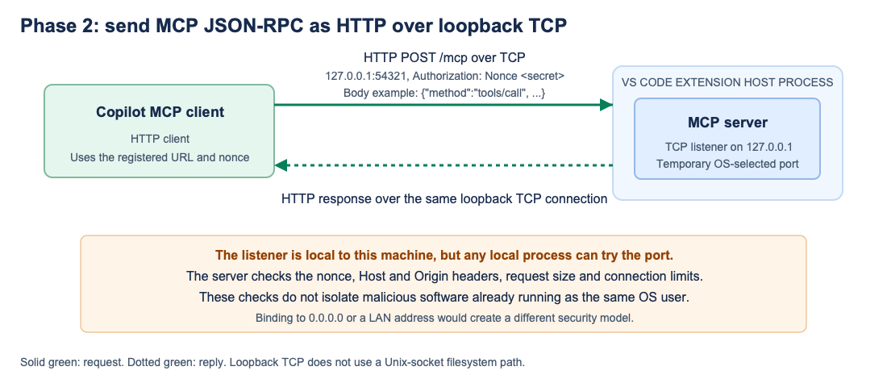
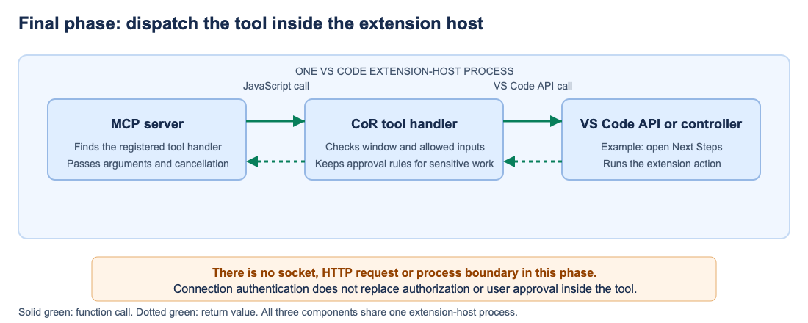

# Loopback HTTP setup and security

[Overview](README.md) | [Loopback HTTP prototype](03-loopback-http.md) | [Transport comparison](04-comparison.md)

## Complete path

Loopback HTTP gives Copilot an ordinary local URL such as `http://127.0.0.1:54321/mcp`. The operating system chooses the port. The MCP server and CoR tool handlers both remain inside the VS Code extension-host process. There is no stdio bridge or separate server executable.

```text
Extension -> VS Code MCP registry -> Copilot MCP client
                                      |
                                      | JSON-RPC in HTTP over loopback TCP
                                      v
                              MCP server in extension host
                                      |
                                      | JavaScript function call
                                      v
                                  CoR handler
```

The first line passes connection settings. It does not carry tool requests. The TCP connection begins only when the MCP client uses those settings.

## Phase 1: registration and connection settings



The extension first registers an MCP provider that offers no active server. After the user trusts the workspace and approves enablement for that window, the extension starts an HTTP listener on the literal address `127.0.0.1`. Authentication is active before the extension publishes the ready definition.

The definition contains a URL such as `http://127.0.0.1:54321/mcp` and an `Authorization: Nonce <secret>` header. VS Code passes those settings to Copilot's MCP client and may retain them in generated `.mcp.json`. This is metadata handoff through VS Code APIs, not HTTP traffic to the MCP server.

### Phase 1 considerations

- The extension must generate a new random nonce for each server lifetime.
- The listener must be ready and require authentication before its URL is published.
- The definition must remain bound to the intended VS Code window and trusted workspace.
- Logs must not contain the nonce.
- Generated settings may outlive the server. A retained nonce must stop working after expiry or shutdown.
- In the tested profiles, an owner-only outer profile directory protected generated files. Normal profiles and every supported operating system still need validation.

## Phase 2: MCP JSON-RPC over loopback TCP



The MCP client sends JSON-RPC inside an HTTP request. For example, `POST http://127.0.0.1:54321/mcp` can carry a `tools/call` request for `open_scaffold_next_steps_view`. The response returns over the loopback TCP connection. The address never routes to the LAN or internet.

Loopback limits the connection to the same machine, but it does not identify the caller. Any local process or OS user can try the port. The server therefore requires the nonce on every request. It also checks the requested HTTP host and browser `Origin`, and it limits request sizes and open connections. Missing or incorrect credentials returned HTTP 401 in the prototype and ran no tool.

### Phase 2 considerations

- Bind exactly to `127.0.0.1`, not `0.0.0.0`, a LAN address or a public interface.
- Treat IPv6 loopback `::1` as separate work rather than broadening the listener.
- Keep Host validation to resist DNS rebinding.
- Reject unexpected browser origins.
- Limit request size, concurrent connections, pending work and request duration.
- Treat the nonce as a bearer credential. Any process that steals it can use it until revocation.
- Do not treat loopback as protection against malicious software running as the same OS user.
- Plain HTTP matches the tested same-machine design. A network-facing server would need a separate transport, identity and authorization design.

### Does this require TLS?

No. The [MCP Streamable HTTP specification](https://modelcontextprotocol.io/specification/2026-07-28/basic/transports/streamable-http#security--endpoint) does not require TLS for a local server on `127.0.0.1`. It requires `Origin` validation, recommends binding local servers only to loopback and recommends authentication. Our design also validates `Host` as defense in depth against DNS rebinding.

The operating system keeps `127.0.0.1` traffic on the machine, so devices on the LAN or internet cannot observe it. Ordinary local processes generally cannot capture loopback traffic without elevated packet-capture privileges, although they can still discover and try the listening port. Administrator or root-level software can inspect local traffic and processes.

Local HTTPS would require certificate creation, client trust, rotation and cleanup. It would add little protection here because both endpoints run on the same machine. Same-user malware is more likely to steal the nonce from retained settings or compromise an endpoint than to intercept the connection. TLS would not stop either attack.

This changes if the server becomes network-facing or adopts the MCP OAuth profile. Remote MCP servers use HTTPS. OAuth bearer tokens also require TLS under the OAuth standards. The prototype uses a temporary nonce rather than MCP OAuth, so that requirement does not apply to this connection.

### What other MCP servers do

Common local MCP servers use stdio. Local servers that offer Streamable HTTP generally use plain loopback HTTP with request validation rather than locally managed certificates. The [official Python SDK](https://github.com/modelcontextprotocol/python-sdk/blob/main/docs/run/index.md#streamable-http) shows plain `http://127.0.0.1`, and [Microsoft Playwright MCP](https://github.com/microsoft/playwright-mcp#standalone-mcp-server) offers plain `http://localhost:<port>/mcp`. Remotely hosted services use HTTPS, as the [GitHub MCP server](https://github.com/github/github-mcp-server#remote-github-mcp-server) does.

## Phase 3: in-process tool dispatch



[SVG source](assets/shared-inprocess-tool-dispatch.svg)

After the server validates and parses the request, it finds the registered tool and calls its JavaScript handler inside the same extension-host process. There is no HTTP, TCP or other process boundary between the MCP server and the extension code. The handler can then call a VS Code API or controller, such as the function that opens the Next Steps screen.

The nonce authenticates access to the MCP server. It does not prove which person, chat or model requested the action, and it does not grant blanket approval. The handler must still validate inputs, select the intended window, limit the available tools and preserve user approval for sensitive work such as deployment or firewall changes.

### Phase 3 considerations

- Register only the tools required by the active workflow.
- Validate tool names, arguments and cancellation before performing an effect.
- Bind requests to the intended extension instance and VS Code window.
- Keep authorization and user approval in the tool implementation.
- Return bounded errors without exposing secrets or internal state.
- Assume a compromised extension host can bypass in-process checks. This design does not create isolation within that process.

## Shutdown, restart and retained settings

The listener runs inside the extension host. Stop, lease expiry or extension disposal closes it and revokes the nonce. The exact lease duration is a policy choice, not a requirement or benefit of loopback HTTP. If the extension host exits unexpectedly, the operating system closes its TCP listener.

On a later activation, the extension starts a new listener on a newly selected port and issues a new nonce. Old settings may remain on disk, but they no longer reach the stopped listener and cannot authenticate to the new one. A production implementation should use one expiry policy based on expected CoR session length, regardless of transport. Restart, cleanup and retained-setting permissions still need validation on every supported operating system.

## Assessment

Loopback HTTP removes the extra stdio bridge process and uses a connection format Copilot accepted in the tested runtime. Its main cost is a named TCP endpoint that any local process can try. Binding only to loopback, requiring a short-lived nonce and validating HTTP requests make that exposure manageable for the prototype, but they do not protect against same-user malware.
