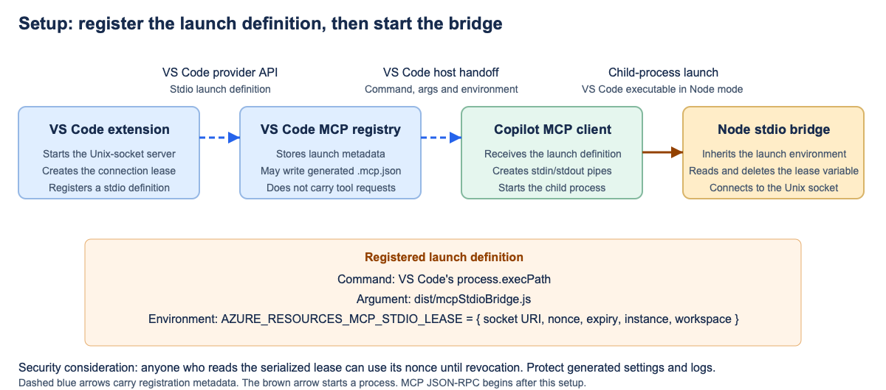
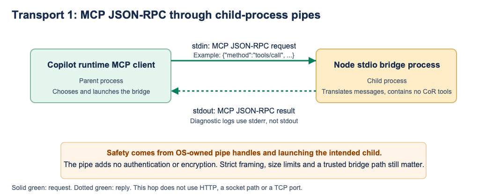
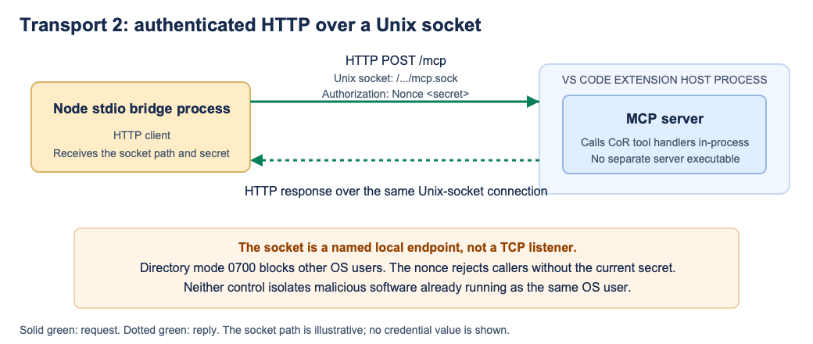

# Stdio bridge security assessment

## Connection path

The stdio bridge keeps CoR tools and the MCP server inside the VS Code extension host. The bridge itself runs as a Node child process and translates between two local transports:

```text
Copilot MCP client
    |
    | MCP JSON-RPC over child-process stdin and stdout
    v
Node stdio bridge process
    |
    | Authenticated HTTP over a Unix socket
    v
MCP server in the VS Code extension host
```

## Setup through the VS Code MCP registry



[SVG source](assets/02-stdio-registration.svg)

The registry is worth showing because it explains how Copilot learns what to launch and how the bridge receives the nonce. It is not a request transport. MCP JSON-RPC does not pass through the registry.

The extension starts the existing MCP server and waits until it is ready. Starting the server returns its Unix-socket address and temporary nonce. The extension serializes those values, the expiry, server instance and workspace binding into one connection lease. It puts that lease in the `AZURE_RESOURCES_MCP_STDIO_LEASE` environment variable of the stdio launch definition registered with VS Code.

VS Code passes the definition to Copilot's MCP client. It contains VS Code's executable as the command, `dist/mcpStdioBridge.js` as the script argument, the connection lease and the settings that run the executable in Node mode. The MCP client launches the bridge as a child process. The bridge inherits the environment, validates the lease, deletes the lease variable from its own environment and sends its nonce with each socket request as `Authorization: Nonce <secret>`.

The nonce is therefore not sent through stdin and is not created by the bridge. Stdin and stdout carry MCP JSON-RPC only. The bridge reads requests from stdin, forwards them to the server, and writes responses to stdout.

The stdio bridge contains no CoR tools and cannot invoke VS Code commands directly. It can only ask the authenticated server to run tools that the extension registered.

## Safety of each transport

### MCP JSON-RPC over stdin and stdout



[SVG source](assets/02-stdio-client-bridge.svg)

The MCP client creates the bridge as a child process and connects pipes to the child's standard input and output. These are operating-system pipe handles, not named files, sockets or TCP ports. Another process cannot discover a port and connect to them. In the normal launch, the MCP client owns one end of each pipe and the bridge owns the other.

This transport has useful isolation, but it does not provide its own authentication or encryption. The bridge trusts whoever controls its stdin because the parent process chose and launched it. The MCP client likewise trusts the program writing to stdout because it chose the bridge executable. If an attacker replaces the bridge script, changes its launch command, or compromises either process, the pipe does not detect that. A same-user process may also be able to inspect or interfere with another process through operating-system debugging facilities, depending on platform policy.

Protocol handling is the main risk on this hop. For example, the client can send a JSON-RPC `tools/call` request on stdin. The bridge must parse it without treating any field as a shell command, cap message sizes and pending requests, and write only valid MCP messages to stdout. Logs belong on stderr. One accidental log line on stdout can corrupt the MCP stream.

### Authenticated HTTP over a Unix socket



The bridge forwards the same request as HTTP, for example `POST /mcp`, through a Unix socket such as `/.../mcp.sock`. A Unix socket is local inter-process communication addressed by a filesystem path. It does not listen on a TCP port and remote machines cannot connect to it.

Unlike anonymous child-process pipes, the socket is a named endpoint. Any local process that can reach its filesystem path can try to connect. The tested implementation puts the socket in a directory with mode 0700, which blocks other OS users from traversing that directory. This does not block malicious code running as the same user.

HTTP and Unix sockets do not inherently authenticate the caller or encrypt the message. This implementation adds authentication with `Authorization: Nonce <secret>`. The MCP server rejects a request without the current secret, and server expiry or shutdown invalidates it. The secret is a bearer credential: any process that obtains it can use it until revocation. The bridge receives it through its launch environment, so logs, generated settings, inherited environments and a compromised bridge are possible disclosure paths.

## In-process tool dispatch


[SVG source](assets/shared-inprocess-tool-dispatch.svg)

After the MCP server validates and parses the socket request, it finds the registered tool and calls its JavaScript handler inside the same extension-host process. There is no HTTP, Unix socket or process boundary between the MCP server and the CoR handler. The handler can then call a VS Code API or controller, such as the function that opens the Next Steps screen.

The nonce authenticates access to the MCP server. It does not prove which person, chat or model requested the action, and it does not grant blanket approval. The handler must still validate inputs, select the intended window, limit the available tools and preserve user approval for sensitive work such as deployment or firewall changes.

### In-process considerations

- Register only the tools required by the active workflow.
- Validate tool names, arguments and cancellation before performing an effect.
- Bind requests to the intended extension instance and VS Code window.
- Keep authorization and user approval in the tool implementation.
- Return bounded errors without exposing secrets or internal state.
- Assume a compromised extension host can bypass in-process checks. This design does not create isolation within that process.

## Existing protections retained

The bridge does not open a TCP port. On the tested macOS system, the server listens on a Unix socket in an owner-only directory with mode 0700. A process must be able to traverse that directory to reach the socket.

Socket requests also require the temporary secret in `Authorization: Nonce <secret>`. Filesystem permissions and request authentication are separate checks. The stdio bridge receives the secret because it is the authorized client for this connection.

Neither part of this route crosses a network. The first hop uses operating-system process pipes and the second uses a local Unix socket.

## Stdio bridge process risks

### Bridge integrity

The MCP client must launch the intended stdio bridge with the intended runtime and arguments. An attacker who can replace the bridge script or modify a writable parent directory could read its environment, capture MCP messages and use the server secret.

The prototype now launches the stdio bridge with VS Code's `process.execPath`, using `ELECTRON_RUN_AS_NODE=1` and `ELECTRON_NO_ASAR=1`. Production code should use a fixed extension-owned bridge path and avoid path lookup or shell command construction.

### Secret delivery and retention

The stdio bridge receives the serialized connection lease through an environment variable inherited at process launch. It deletes that variable after reading it and must not log the socket address or nonce. If it ever starts child processes before deletion, it must remove the lease variable from their environments.

VS Code also stores generated connection settings. In the tested profiles, secret-bearing files had mode 0644 inside directories with mode 0755, while an enclosing profile directory had mode 0700. The enclosing directory restricted access on that machine, but permissions and retention still need validation in normal F5 use and on every supported operating system. The extension cannot erase every copy retained by VS Code.

### Input handling

The stdio bridge accepts untrusted MCP input from stdin. It must enforce protocol framing and message-size limits, reject malformed JSON-RPC, forward cancellation correctly and return bounded errors. Message fields must never become shell commands or executable code.

The prototype tested invalid input, authentication, cancellation and reconnecting. It also handles the unsupported `server/discover` request by returning JSON-RPC error `-32601`, rather than claiming the server supports that method.

### Process and connection lifetime

The MCP client, stdio bridge process and socket server have separate lifetimes. Closing stdin or ending the client session should terminate the bridge process, cancel pending work and release its connection. Server-side expiry must reject an old secret even if a bridge process or generated configuration survives.

The stdio prototype uses a short-lived access lease. Its exact duration is a policy choice, not a requirement or benefit of stdio. Connection ownership, orphaned bridge-process cleanup, server resource limits and restart behavior still need production validation.

When the extension stops, extension disposal closes the MCP server's Unix-socket listener and revokes its nonce. The bridge should detect the closed backend connection and exit. It also shuts down when Copilot closes stdin, it receives `SIGTERM` or `SIGINT`, its lease expires, initialization times out, or a request times out.

When the extension activates again, it starts a new listener with a new server instance and nonce. An old bridge cannot authenticate to that server. The extension can then be rebuilt and reactivated, but a bridge that has not exited may continue running the old bridge code until one of its shutdown conditions occurs. Copilot's MCP client owns the child process, so the extension cannot directly kill it. Production validation must confirm orphan cleanup and rebuild behavior on every supported operating system.

### Platform differences

The recorded tests used macOS Unix sockets. Windows named pipes use access-control lists rather than Unix directory modes. Windows needs explicit tests for pipe permissions, stdio bridge launch, environment exposure and cleanup. Other supported operating systems need the same validation rather than an assumption that the macOS result applies.

## Authentication is not authorization

The temporary secret proves that the caller obtained the connection settings. It does not prove which chat, model or person requested a tool call. It also does not represent user approval for a sensitive operation.

The extension should select the intended VS Code window explicitly and keep approval checks for actions such as changing database firewall rules or deploying resources. Tool access should be restricted to the tools required by the active workflow.

## Threats outside this design

The bridge does not isolate malicious software running with the same OS user's privileges. Such software may be able to read user-owned files, inspect or modify the stdio bridge, access process information, or invoke other VS Code capabilities.

The design also relies on VS Code and the MCP client to protect child-process pipes and launch configuration. If either trusted component is compromised, the bridge cannot establish an independent caller identity.

## Production checklist

- Launch a fixed, extension-owned stdio bridge with VS Code's bundled runtime.
- Never invoke a shell to construct the stdio bridge command.
- Keep the stdio bridge and its parent directories writable only by the trusted user and extension installation process.
- Generate a random secret for each server lifetime and reject it after expiry or shutdown.
- Prevent secrets and socket paths from appearing in logs or inherited child environments.
- Enforce stdio framing, message-size, concurrency and pending-request limits.
- Propagate cancellation and terminate the stdio bridge when its client disconnects.
- Keep sensitive tool approval separate from connection authentication.
- Validate generated-setting permissions and retention in normal profiles.
- Test Unix socket and Windows named-pipe permissions on every supported platform.

## Assessment

The stdio bridge preserves the existing private server and does not add a network listener. Its security depends on treating the bridge process as trusted, security-sensitive code. The bridge is suitable for further work if production hardening covers bridge integrity, secret handling, strict protocol parsing, process cleanup, server resource limits and platform-specific socket permissions.
