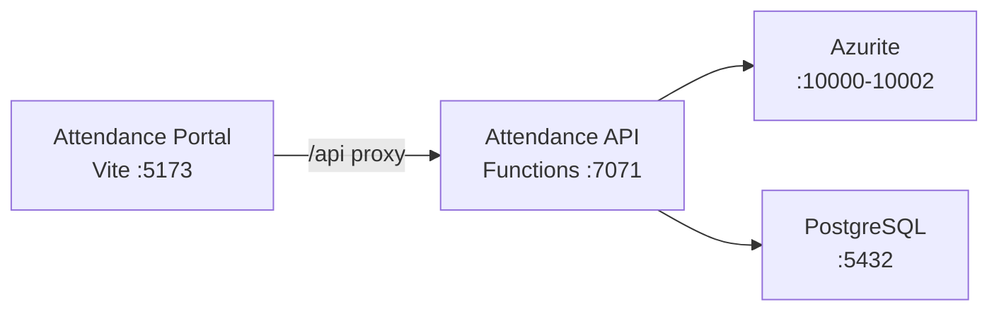

# Azure Debug Plan

> This plan is the source of truth for generating the
> VS Code debug setup in this workspace.
>
> **Status:** Planning
> **Execution Mode:** Guided
> **Created:** 2026-07-20
> **Last Updated:** 2026-07-20

---

## Prerequisites

| Tool / Extension | Category | Service(s) | Installed | Version | Install |
|------------------|----------|------------|-----------|---------|---------|
| Node.js | Runtime | * | ✅ | 24.18.0 | `brew install node` |
| npm | Package manager | * | ✅ | 11.16.0 | Bundled with Node.js |
| Azure Functions Core Tools | Runtime | attendance-api | ✅ | 4.12.1 | `npm install -g azure-functions-core-tools@4` |
| Docker | Container runtime | attendance-api | ✅ | 29.3.1 | https://docs.docker.com/get-docker/ |
| Docker Compose | Orchestrator | attendance-api | ❓ | — | https://docs.docker.com/compose/install/ |
| Chrome | Browser | attendance-portal | ✅ | — | https://www.google.com/chrome/ |
| `ms-azuretools.vscode-azurefunctions` | VS Code extension | attendance-api | ✅ | 1.22.0 | VS Code Extensions Marketplace |

> ⚠️ **Action required:** Install any tools or extensions marked ❌ before approving this plan, and confirm any marked ❓ (e.g. Docker Compose) are installed and ready.

---

## Debug Configurations

Each checked row below produces a VS Code debug configuration in the `.vscode/launch.json`.

| Generate | Debug Config Name | Service Label | Service Root | Project Type | Runtime | Version | Azure Dependencies |
|----------|-------------------|---------------|--------------|--------------|---------|---------|-----|
| [x] | Attendance API (debug) | Attendance API | ./services/attendance-api | functions | node-ts | 24.x | Azure Storage, PostgreSQL |
| [x] | Attendance Portal (debug) | Attendance Portal | ./services/attendance-portal | frontend-spa | node-ts | 24.x | — |
| [x] | Debug All Services | Debug All Services | | *Compound Config* | | | |

ℹ️ Project Type Descriptions

| Project Type | Description |
|-------------|-------------|
| functions | Azure Functions — serverless compute with triggers and bindings |
| frontend-spa | Single-page application served by a dev server (Vite, Next.js, Angular, etc.) |

> ℹ️ **Proxy detected:** Attendance Portal proxies `/api` requests to Attendance API (`http://localhost:7071`) via `vite.config.ts`. The compound config starts backends before frontends.

---

## Orchestrator

| Orchestrator | Description |
|-------------|-------------|
| Docker Compose | Uses Docker Compose to orchestrate emulators and dependent services during local development |

---

## Emulators

| Dependent Service | Emulator | Purpose |
|-------------------|----------|---------|
| Azure Storage | Azurite Container | Blob/queue/table storage for Azure Functions host runtime (AzureWebJobsStorage) |
| PostgreSQL | PostgreSQL Container | Relational database for attendance records, compliance rules, and planned entries |

---

## Architecture Diagram

During debugging, the Attendance API (Azure Functions) connects to Azurite and PostgreSQL emulators running in Docker containers, while the Attendance Portal (Vite SPA) proxies API requests to the Functions host.

---

## Migrations

When selected, the generation phase creates automated VS Code tasks that run migration scripts on launch — so emulator databases are automatically provisioned with the correct schema and seed data before the app starts debugging. No manual migration steps needed.

| Generate | Service | Migration Tool |
|----------|---------|---------------|
| [x] | Attendance API | Raw SQL (custom runner: `node migrations/run.js`) |

---

## API Test Collections

When selected, the generation phase produces lightweight, runnable API test scripts in the project so you can quickly smoke-test endpoints and triggers once everything is launched and connected locally.

| Generate | Service | Description |
|----------|---------|-------------|
| [x] | Attendance API | 

HTTP Endpoints (11)
 GET /api/health GET /api/attendance POST /api/attendance PUT /api/attendance/{id} DELETE /api/attendance/{id} GET /api/compliance GET /api/compliance/history GET /api/planned POST /api/planned GET /api/rules PUT /api/rules  
 |

---

## Convenience Scripts

| Generate | Script | Registered In | Description |
|----------|--------|---------------|-------------|
| [x] | emulators:start | ./package.json | Start all emulators in the background, preserving existing data |
| [x] | emulators:stop | ./package.json | Stop all running emulators |
| [x] | emulators:clean | ./package.json | Stop emulators and delete all data (fresh start) |
| [x] | db:migrate | ./package.json | Apply pending database migrations to the emulator database |
