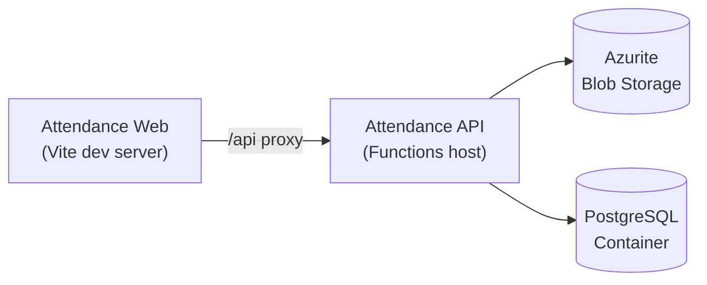

# Azure Debug Plan

> This plan is the source of truth for generating the
> VS Code debug setup in this workspace.
>
> **Status:** Implemented
> **Execution Mode:** Auto
> **Created:** 2026-07-21T23:22:53Z
> **Last Updated:** 2026-07-21T23:35:00Z

---

## Prerequisites

| Tool / Extension | Category | Service(s) | Installed | Version | Install |
|------------------|----------|------------|-----------|---------|---------|
| Node.js | Runtime | * | ✅ | v24.18.0 | https://nodejs.org |
| npm | Package manager | * | ✅ | 11.16.0 | Bundled with Node.js |
| Azure Functions Core Tools | Runtime | attendance-api | ✅ | 4.12.1 | `npm i -g azure-functions-core-tools@4 --unsafe-perm true` |
| Docker | Container runtime | attendance-api (Blob Storage + PostgreSQL emulators) | ✅ | 29.3.1 | https://www.docker.com/products/docker-desktop |
| Docker Compose | Orchestrator | attendance-api | ❓ | — | Ensure Docker Compose is installed and ready (ships with Docker Desktop) |
| Chrome | Browser | attendance-web | ✅ | (installed) | https://www.google.com/chrome/ |
| `ms-azuretools.vscode-azurefunctions` | VS Code extension | attendance-api | ✅ | 1.20.3 / 1.22.0 | VS Code Marketplace |

> ⚠️ **Action required:** Confirm Docker Compose (❓) is installed and ready — it ships with Docker Desktop, which is already detected.

---

## Debug Configurations

Each checked row below produces a VS Code debug configuration in the `.vscode/launch.json`.

| Generate | Debug Config Name | Service Label | Service Root | Project Type | Runtime | Version | Azure Dependencies |
|----------|--------------------|---------------|--------------|--------------|---------|---------|-----|
| [x] | Attendance API (debug) | Attendance Compliance API | ./api | functions | node-ts | 24.x | Azure Storage, PostgreSQL |
| [x] | Attendance Web (debug) | Attendance Compliance Web App | ./web | frontend-spa | node-ts | 24.x | — |
| [x] | Debug Full Stack | Debug Full Stack | | *Compound Config* |||| |

ℹ️ Project Type Descriptions

| Project Type | Description |
|-------------|-------------|
| functions | Azure Functions — serverless compute with HTTP-triggered handlers |
| frontend-spa | Single-page application served by a dev server (Vite + React) |

> ℹ️ **Proxy detected:** Attendance Compliance Web App proxies `/api` requests to Attendance Compliance API on `http://localhost:7071` (via `web/vite.config.ts`). The compound config starts the API before the web app.

> ℹ️ Microsoft Entra ID is also an Essential dependency (auth), but it has no local emulator — `api/src/middleware/auth.ts` falls back to a mock `dev-user` identity locally when `AZURE_AD_TENANT_ID`/`AZURE_AD_CLIENT_ID` are unset, so no additional debug wiring is required for it.

---

## Orchestrator

| Orchestrator | Description |
|-------------|-------------|
| Docker Compose | Uses Docker Compose to orchestrate the Azurite and PostgreSQL emulator containers during local development (no existing compose file detected — one will be generated) |

---

## Emulators

| Dependent Service | Emulator | Purpose |
|-------------------|----------|---------|
| Azure Storage | Azurite Container | Backing storage account for the Azure Functions host (`AzureWebJobsStorage`) and app-level blob storage checks |
| PostgreSQL | PostgreSQL Container | Primary data store for attendance policies, entries, and plans |

---

## Architecture Diagram

During debugging, the web app's dev server proxies API calls to the local Functions host, which reads/writes to the Azurite and PostgreSQL containers.

---

## Migrations

| Generate | Service | Migration Tool |
|----------|---------|---------------|
| [x] | Attendance Compliance API | Raw SQL (`api/migrations/*.sql` applied via `api/scripts/migrate.js`, tracked in `schema_migrations`) |

---

## API Test Collections

| Generate | Service | Description |
|----------|---------|-------------|
| [x] | Attendance Compliance API | 

HTTP Endpoints (10)
 GET /api/health GET /api/policy PUT /api/policy GET /api/entries POST /api/entries DELETE /api/entries/{date} GET /api/compliance/summary GET /api/plans POST /api/plans GET /api/compliance/comparison  
 |

---

## Convenience Scripts

| Generate | Script | Registered In | Description |
|----------|--------|---------------|-------------|
| [x] | emulators:start | ./package.json | Start the Azurite and PostgreSQL containers in the background, preserving existing data |
| [x] | emulators:stop | ./package.json | Stop the running emulator containers |
| [x] | emulators:clean | ./package.json | Stop the emulator containers and delete all data (fresh start) |
| [x] | db:migrate | ./package.json | Apply pending database migrations to the emulator PostgreSQL database (delegates to `api`'s `db:migrate` script) |

---

## Pre-Flight Resolution Notes

> ⚠️ **Port conflict resolved automatically (autopilot mode):** Port `5432` was already in use by another local PostgreSQL instance on this machine. The PostgreSQL emulator's host-side port was remapped to **`5433`** (container-internal port remains `5432`). Updated references: `docker-compose.yml` (`ports: ["5433:5432"]`), `api/local.settings.json` (`DATABASE_URL`), and `.env.example` (`DATABASE_URL`). No stale emulator data directories (`.azurite/`, `.postgres/`) were found.

## Debug Configuration Checklist

Debug Configuration Checklist:
✅ Attendance API (debug) — Ready signal `Host lock lease acquired` observed on `attendance-compliance-api: func host start`; `curl http://localhost:7071/api/health` → `200` (`{"status":"healthy","services":{"database":true,"storage":true}}`); Node debugger listening on `ws://127.0.0.1:9229`; `tsconfig.json` has `sourceMap: true`; `dist/**/*.js.map` generated by `npm run build`.
✅ Attendance Web (debug) — Ready pattern `VITE` … `Local:` observed on `attendance-compliance-web-app: npm run dev`; `curl http://localhost:5173` → `200`; `curl http://localhost:5173/api/health` (proxy to API) → `200`.
✅ Debug Full Stack — Both member configurations (`Attendance API (debug)`, `Attendance Web (debug)`) passed; `Start All Services` sequenced task starts the API before the web app per the detected proxy dependency.
✅ Emulators — `docker compose up -d azurite postgres`: both containers started, `postgres` reached `healthy` status; `docker compose up db-migrate`: applied all 3 pending migrations (`001_create_attendance_policies.sql`, `002_create_attendance_entries.sql`, `003_create_attendance_plans.sql`) and exited `0`.
