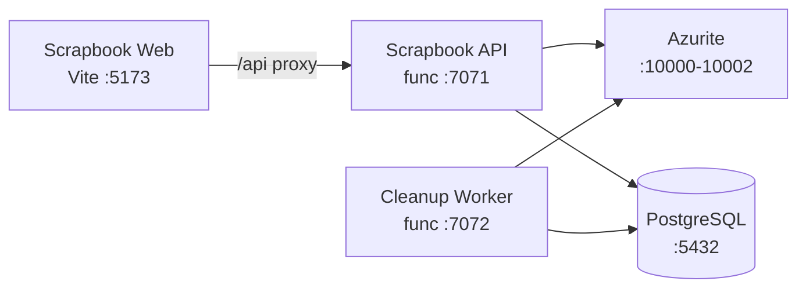

# Azure Debug Plan

> This plan is the source of truth for generating the
> VS Code debug setup in this workspace.
>
> **Status:** Planning
> **Execution Mode:** Guided
> **Created:** 2026-07-21
> **Last Updated:** 2026-07-21

---

## Prerequisites

| Tool / Extension | Category | Service(s) | Installed | Version | Install |
|------------------|----------|------------|-----------|---------|---------|
| Node.js | Runtime | * | ✅ | v24.18.0 | `brew install node` |
| npm | Package manager | * | ✅ | 11.16.0 | Bundled with Node.js |
| Azure Functions Core Tools | Runtime | scrapbook-api, cleanup-worker | ✅ | 4.12.1 | `brew install azure-functions-core-tools@4` |
| Docker | Container runtime | scrapbook-api, cleanup-worker | ✅ | 29.3.1 | https://docs.docker.com/desktop/install/mac-install/ |
| Docker Compose | Orchestrator | scrapbook-api, cleanup-worker | ❓ | — | Bundled with Docker Desktop |
| Chrome | Browser | scrapbook-web | ✅ | — | https://www.google.com/chrome/ |
| `ms-azuretools.vscode-azurefunctions` | VS Code extension | scrapbook-api, cleanup-worker | ✅ | 1.22.0 | Install from VS Code Marketplace |

> ⚠️ **Action required:** Confirm Docker Compose (marked ❓) is installed and ready before approving this plan.

---

## Debug Configurations

Each checked row below produces a VS Code debug configuration in the `.vscode/launch.json`.

| Generate | Debug Config Name | Service Label | Service Root | Project Type | Runtime | Version | Azure Dependencies |
|----------|-------------------|---------------|--------------|--------------|---------|---------|-----|
| [x] | Scrapbook API (debug) | Scrapbook API | ./services/scrapbook-api | functions | node-ts | 24.x | Azure Storage, PostgreSQL |
| [x] | Cleanup Worker (debug) | Cleanup Worker | ./services/cleanup-worker | functions | node-ts | 24.x | Azure Storage, PostgreSQL |
| [x] | Scrapbook Web (debug) | Scrapbook Web | ./services/scrapbook-web | frontend-spa | node-ts | 24.x | — |
| [x] | Debug All Services | Debug All Services | | *Compound Config* | | | |

ℹ️ Project Type Descriptions

| Project Type | Description |
|-------------|-------------|
| functions | Azure Functions — serverless compute with triggers and bindings |
| frontend-spa | Single-page application served by a dev server (Vite, Next.js, Angular, etc.) |

> ℹ️ **Proxy detected:** Scrapbook Web proxies `/api` requests to Scrapbook API (`http://localhost:7071`) via `vite.config.ts`. The compound config starts backends before the frontend.

---

## Orchestrator

| Orchestrator | Description |
|-------------|-------------|
| Docker Compose | Uses Docker Compose to orchestrate emulators and dependent services during local development |

---

## Emulators

| Dependent Service | Emulator | Purpose |
|-------------------|----------|---------|
| Azure Storage | Azurite Container | Blob storage for photo uploads and Azure Functions host runtime (trigger management, lease coordination) |
| PostgreSQL | PostgreSQL Container | Relational database for users, pairs, photos, and photo labels |

---

## Architecture Diagram

During local debugging, both Azure Functions services connect to Azurite for blob storage and a PostgreSQL container for data persistence. The Vite dev server proxies API calls to the Scrapbook API function host.

---

## Migrations

When selected, the generation phase creates automated VS Code tasks that run migration scripts on launch — so emulator databases are automatically provisioned with the correct schema and seed data before the app starts debugging. No manual migration steps needed.

| Generate | Service | Migration Tool |
|----------|---------|---------------|
| [x] | Scrapbook API | Knex |

---

## API Test Collections

When selected, the generation phase produces lightweight, runnable API test scripts in the project so you can quickly smoke-test endpoints and triggers once everything is launched and connected locally.

| Generate | Service | Description |
|----------|---------|-------------|
| [x] | Scrapbook API | 

HTTP Endpoints (12)
 GET /api/health GET /api/openapi.json POST /api/pairs GET /api/pairs PATCH /api/pairs/{id}/accept DELETE /api/pairs/{id} POST /api/photos GET /api/photos GET /api/photos/{id} PATCH /api/photos/{id} DELETE /api/photos/{id} GET /api/photos/timeline  
 |
| [x] | Cleanup Worker | 

Triggers (1)
 timerTrigger — cleanupExpiredPhotos (daily at 2:00 AM UTC)  
 |

---

## Convenience Scripts

| Generate | Script | Registered In | Description |
|----------|--------|---------------|-------------|
| [x] | emulators:start | ./package.json | Start all emulators in the background, preserving existing data |
| [x] | emulators:stop | ./package.json | Stop all running emulators |
| [x] | emulators:clean | ./package.json | Stop emulators and delete all data (fresh start) |
| [x] | db:migrate | ./package.json | Apply pending database migrations to the emulator database |
